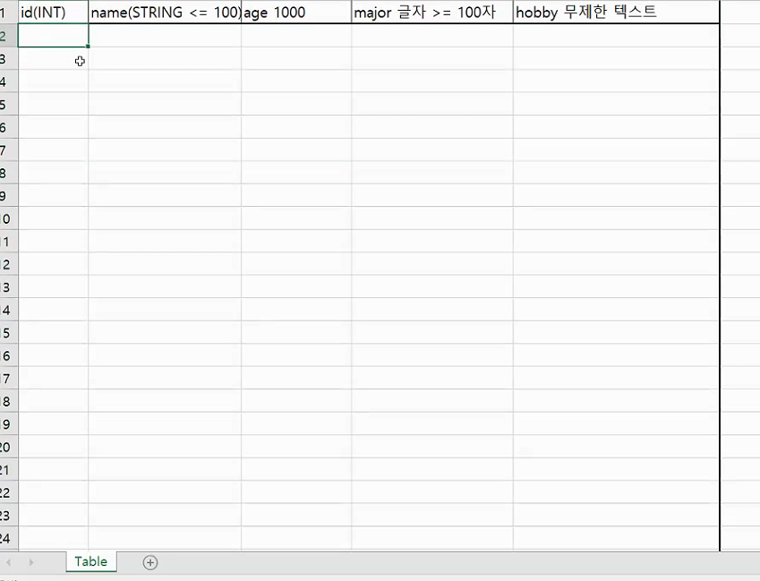
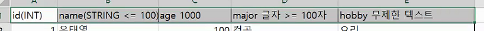
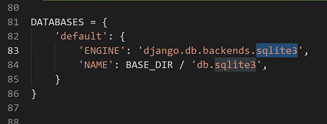

# About DB

* db 의 첫 시작 - tabe 생성

  * table 의 가로에 몇 개의 정보를 담을 것인지 미리 정해줘야함

  * 세로는 몇개든 상관 ㄴㄴ

  * 이후 땅땅땅 하며 고정해서 테이블 생성

    

* 파이썬에서 위와 같이 db에 반영되도록 하는 것이 MODEL

* 저기 sqlite3 에 다른 것으로 바꿀 수도 있다