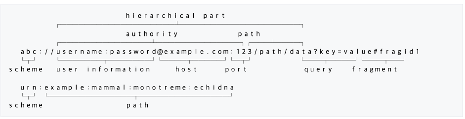
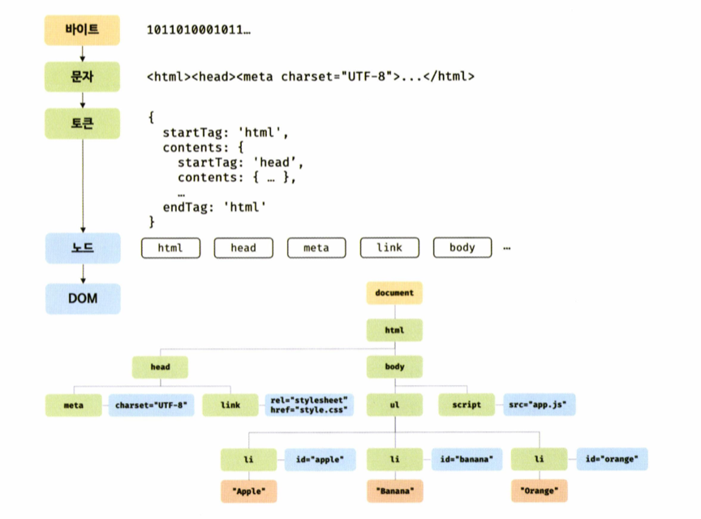
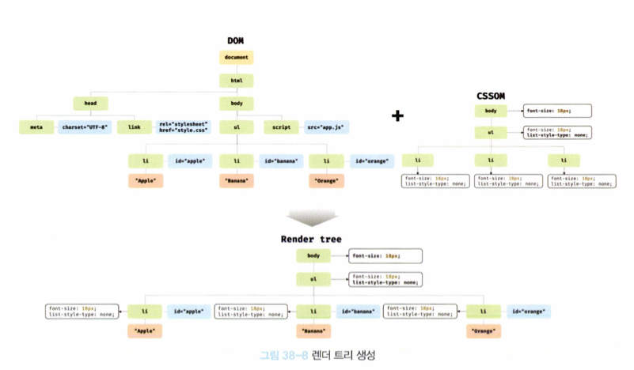
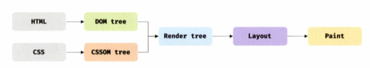

# 브라우저 작동 원리

1. 렌더링에 필요한 소스(HTML, CSS, JS, Img, Font, Etc..)를 요청하고 서버로부터 응답 받음
2. 브라우저 렌더링 엔진이 서버로부터 응답된 HTML, CSS 파싱하여 DOM, CSSOM 생성, 이를 결합하여 `렌더 트리` 생성
3. 브라우저 JS 엔진은 서버로부터 응답된 JS를 파싱하여 `AST`를 생성, 바이트코드로 변환하여 실행.
   * 이때 JS는 DOM API를 통해 DOM이나 CSSOM 변경 가능
   * 변경된 DOM/CSSOM은 다시 렌더 트리로 결합
4. 렌더 트리 기반으로 HTML 요소의 레이아웃(위치, 크기)을 계산하고 브라우저 화면에 HTML 요소 페인팅

## 요청과 응답

* 브라우저의 핵심 기능은 필요한 리소스를 서버에 요청하고 서버로부터 응답받아 브라우저에 **시각적**으로 렌더링 하는 것

  * 즉, 렌더링에 필요한 리소스는 모두 서버에 존재하기에
  * 서버에 필요한 리소스를 **요청**하고 서버가 응답한 리소스를 파싱하여 렌더링

* 서버에 요청을 전송하기 위해 브라우저는 주소창 제공

  * 브라우저의 주소창에 URL을 입력하고 엔터를 누르면
  * URL의 호스트 이름이 DNS를 통해 IP주소로 변환
  * 변환된 IP 주소를 갖는 서버에게 요청 전송

* 통합 자원 식별자(URI) (출처: https://ko.wikipedia.org/wiki/통합\_자원\_식별자)

  * Uniform Resource Identifier
  * 인터넷에 있는 자원을 나타내는 **유일한** 주소
  * URI의 존재는 인터넷에서 요구되는 기본조건
  * 프로토콜에 항상 붙어다님
  * 구성부분
  * 
  * URL과의 차이점?
    * Uniform Resource Locator
    * 네트워크 상 자원이 어디 있는지 알려주기 위한 규약
    * 즉, 컴퓨터 네트워크와 검색 매커니즘에서의 위치를 지정하는, 웹 리소스에 대한 **참조**

* 주소창에 `http://naver.com`을 입력하고 엔터를 누르면?

  * DNS 서버에서 naver.com에 해당하는 IP 주소를 검색하고
  * 이 IP주소에 요청을 보냄
  * 이 요청에 명확히 리소스를 요청하는 내용은 없지만 일반적으로 서버는 루트 요청에 대해 암묵적으로 `index.html`을 응답하도록 기본 설정 되어 있음
  * `http://naver.com/index.html`로 요청을 보내는 셈
  * 따라서 서버는 루트 요청에 대해 서버 루트 폴더에 존재하는 정적 파일 `index.html`을 클라이언트로 응답

  

## HTML Parsing/DOM Creating

* 브라우저 요청에 의해 서버가 응답합 HTML 문서는 문자열로 이루어진 순수 텍스트

  * 순수 텍스트인 HTML 문서를 브라우저에 시각적인 픽셀로 렌더링하기 위해서는 HTML 문서를 브라우저가 이해할 수 있는 자료구조(객체)로 변환하여 메모리에 저장해야 함

* 예를 들어 다음과 같은 `index.html` 이 서버로부터 응답되었다면

  ```HTML
  <!DOCTYPE html>
  <html>
    <head>
      <meta charset="UTF-8">
      <link rel="stylesheet" href="style.css">
    </head>
    <body>
      <ul>
        <li id="apple">Apple</li>
        <li id="banana">Banana</li>
        <li id="orange">Orange</li>
      </ul>
      <script src="app.js"></script>
    </body>
  </html>
  ```

  * 브라우저의 렌더링 엔진은 다음과 같은 과정을 통해 응답받은 HTML 문서를 파싱하여 브라우저가 이해할 수 있는 자료구조인 DOM(Document Object Model) 생성
  * 
    1. 서버에 존재하던 HTML 파일이 브라우저 요청에 의해 응답
       * 이때 서버는 브라우저가 요청한 HTML 파일을 읽어 들여 메모리에 저장한 다음
       * 메모리에 저장된 바이트(2진수)를 인터넷을 경유하여 응답
    2. 브라우저는 서버가 응답한 HTML 문서를 바이트 형태로 응답받음
       * 그리고 응답된 바이트 형태의 HTML 문서는 meta 태그의 charset 어트리뷰트에 의해 지정된 인코딩 방식(현재는 UTF-8)을 기준으로 문자열로 변환
       * meta tag의 charset 어트리뷰트에 선언된 인코딩 방식은 응답 헤더에 담겨 응답
       * 브라우저는 이를 확인하고 문자열로 변환
    3. 문자열로 변환된 HTML 문서를 읽어 들여 문법적 의미를 갖는 코드 최소 단위인 `token`들로 분해
    4. 각 `token`들을 객체로 변환하여 `node`생성
       * 토큰의 내용에 따라 문서 노드, 요소 노드, 어트리뷰트 노드, 텍스트 노드가 생성
       * 노드는 이후 DOM을 구성하는 기본 요소가 됨
    5. HTML 문서는 HTML 요소들의 집합으로 이루어지며 HTML 요소는 **중첩 관계**를 가짐
       * 즉, HTML 요소의 콘텐츠 영역(시작 태그와 종료 태그 사이)에는 텍스트 뿐 아니라 다른 HTML 요소도 포함 가능
       * 이때 HTML 요소 간에는 중첩 관계에 의해 부자 관계 형성
       * 이러한 부자 관계를 반영하여 모든 노드들을 `트리` 자료구조로 구성
       * 이 노드들로 구성된 트리 자료구조를 `DOM`이라 부름

* DOM은 HTML 문서를 파싱한 결과물

## CSS Parsing/CSSOM Creating

* 렌더링 엔진은 HTML을 처음부터 한 줄씩 순차적으로 파싱하여 DOM 생성

  * DOM 생성중 CSS를 로드하는 link 태그나 style 태그 만나면 DOM 생성 일시 중단
  * 태그에 지정된 CSS 파일을 서버에 요청
  * 로드한 CSS 내용을 HTML과 동일한 과정(바이트 → 문자 → 토큰 → 노드 → CSSOM)을 거쳐 해석
  * CSSOM(CSS Object Model) 생성
  * 이후 CSS 파싱 완료하면 HTML 파싱이 중단 지점부터 다시 시작하여 DOM 생성 재개

* CSSOM은 CSS의 상속 반영하여 생성

  * 각 노드마다 상속되는 스타일이 계속하여 반영되는 것

  

  * `font-size: 18;` `list-style-type: none;` 이 계속해서 상속되는 모습


## Create Render Tree

* DOM CSSOM 생성 이후 DOM CSSOM 렌더링을 위해 `render tree`로 결합
* 렌더 트리는 렌더링을 위한 트리 구조의 자료구조
  * 따라서 브라우저 화면에 렌더링되지 않는 노드(meta, script 태그 등)
  * `display: none;` 스타일이 붙은 노드들은 포함되지 않음
  * 렌더 트리는 브라우저 화면에 렌더링되는 노드만으로 구성



* 이후 완성된 렌더 트리는 각 HTML 요소의 레이아웃(위치와 크기)을 계산하는 데 사용
  * 브라우저 화면에 픽셀을 렌더링하는 페인팅 처리에 입력
  * 
* 지금까지 살펴본 렌더링 과정은 반복해서 실행될 수 있음
  * 자바스크립트에 의한 노드 추가나 삭제
  * 브라우저 창의 리사이징에 의한 뷰포트 크기 변경
  * 요소 레이아웃에 변경 발생시키는 스타일 변경

