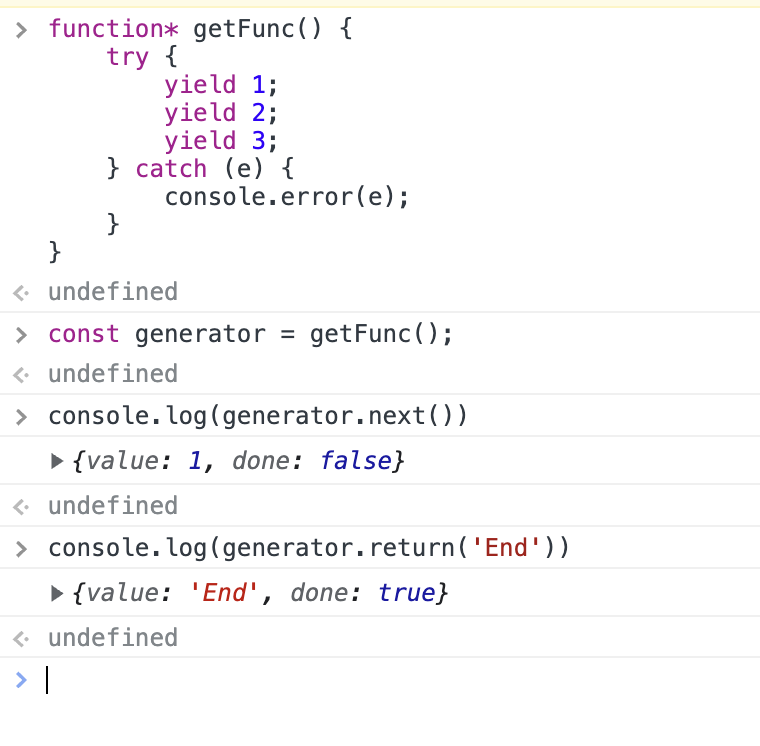
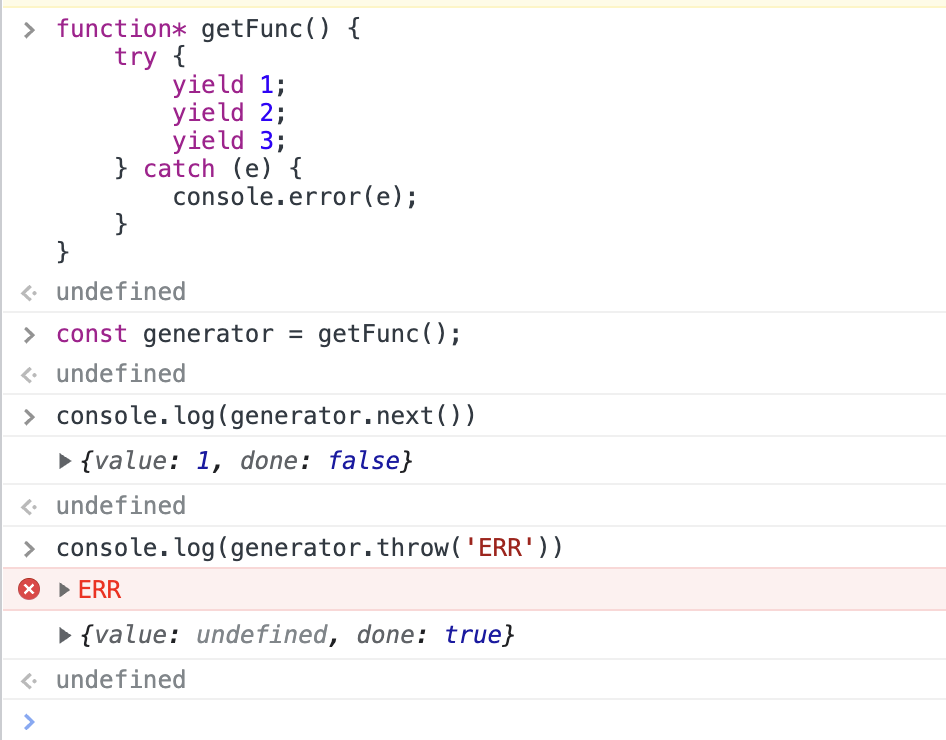
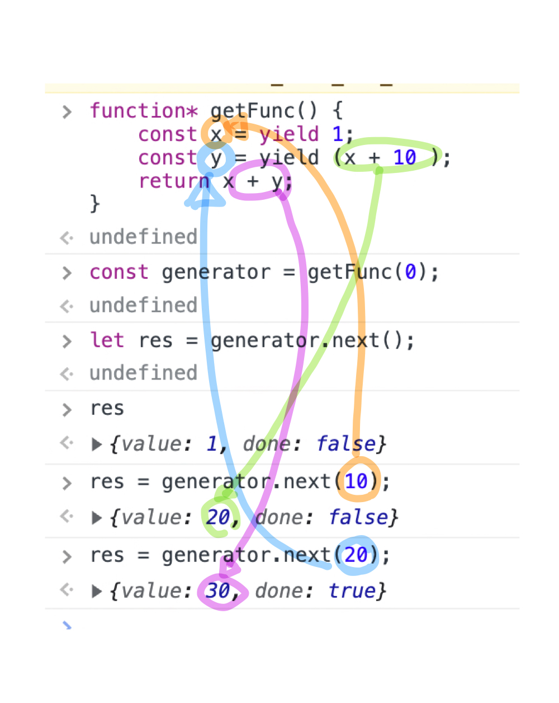

# Generator

* ES6에서 도입
* 코드 블록의 실행을 일시 중재했다가 필요한 시점에 재개할 수 있는 특수한 함수
* 일반함수와의 차이점
  * 제네레이터 함수는 함수 호출자에게 함수 실행의 제어권 양도 가능
    * 일반 함수 호출 시 제어권이 함수에게 넘어가고 함수 코드를 **일괄 실행**
    * 즉, caller는 함수를 호출한 이후 함수 실행을 제어할 수 없음
    * 제네레이터 함수는 함수 실행을 함수 호출자가 제어 가능
    * caller가 함수 실행을 일시 중지시키거나 재개시킬 수 있음
    * 함수 제어권을 함수가 독점하는 것이 아닌 caller에게 양도*yield*할 수 있음 의미
  * 제네레이터 함수는 caller와 함수의 **상태**를 주고받을 수 있다
    * 일반 함수 호출하면 매개변수를 통해 함수 외부에서 값을 주입받고 함수 코드를 일괄 실행하여 결과값을 함수 외부로 반환
    * 즉, 함수 실행 중에는 함수 외부에서 함수 내부로 값을 전달하여 함수의 상태를 변경할 수 없음
    * 제네레이터 함수는 caller와 **양방향**으로 함수의 상태 주고받기 가능
    * 제네레이터 함수는 caller에게 상태 전달 가능/caller로부터 상태 전달받기 가능
  * 제네레이터 함수 호출 시 `제네레이터 객체` 반환
    * 일반 함수 호출 시 함수 코드 일괄 실행 후 **값** 반환
    * 제네레이터 함수 호출 시 함수 코드를 실행하는 것이 아닌 이터러블이면서 동시에 이터레이터인 제네레이터 객체 반환

## 참고: 이터러블

* 이터레이션 프로토콜은 순회 가능한 데이터 컬렉션(자료구조)을 만들기 위해 ECMAScript 사양에 정의하여 미리 약속한 규칙
  * ES6에서 도입
* ES6 이전 순회 가능한 데이터 컬렉션은 통일된 규약 없이 각자 나름의 구조를 가지고 다양한 방법으로 순회하였음
  * ES6에서는 순회 가능한 데이터 컬렉션을 이터레이션 프로토콜을 준수하는 이터러블로 통일하여
    * `for ... of문`, `Spread Syntax`, `Array Destructureing` 의 대상으로 사용할 수 있도록 **일원화**
* 이터러블 프로토콜
  * `Well-known Symbol`인 `Symbol.iterator`를 프로퍼티 키로 사용한 메서드를 직접 구현하거나
  * 프로토타입 체인을 통해 상속받은 `Symbol.iterator` 메서드를 호출하면 이터레이터 프로토콜을 준수한 이터레이터 반환
  * 이러한 규약을 이터러블 프로토콜이라 부름
  * 이터러블 프로토콜을 준수한 객체를 이터러블이라 함
* 이터레이터 프로토콜
  * 이터러블의 `Symbol.iterator` 메서드를 호출하면 이터레이터 프로토콜을 준수한 **이터레이터**반환
  * 이터레이터는 `next` 메서드를 소유
  * `next` 메서드 호출 시 이터러블 순회하며 value와 done 프로퍼티를 갖는 이터레이터 리절트 객체를 반환
  * 이러한 규약을 이터레이터 프로토콜이라 부름
  * 이터레이터 프로토콜을 준수한 객체를 이터레이터라 부름
  * 이터레이터는 이터러블의 요소를 탐색하기 위한 **포인터 역할**을 함

## 제네레이터 함수의 정의

* `function*` 키워드로 선언
* 하나 이상의 `yield` 표현식 포함
* 위 두개 제외하면 일반 함수 정의방법과 같음

```js
// 제네레이터 함수 선언문
function* getDecFunc() {
  yield 1;
}

// 제네레이터 함수 표현식
const getExpFunc = function* () {
  yield 1;
};

// 제네레이터 메서드
cosnt obj = {
  * getObjMethod() {
    yield 1;
  }
};

// 제네레이터 클래스 메서드
class MyClass {
  * getClsMethod() {
    yield 1;
  }
}
```

* 애스터리스크`*` 의 위치는 function 키워드와 함수 이름 사이라면 어디든 상관 없음

  * 킹치만 일관성을 지키자

* 정의 불가 사항

  * 제네레이터 함수는 화살표 함수로 정의 불가

  * `new` 연산자와 함께 생성자 함수로 호출 불가


## 제네레이터 객체

* 제네레이터 함수 호출 시 일반 함수처럼 함수 코드 블록 실행하는 것이 아닌

  * 제네레이터 객체 생성하여 반환
  * 제네레이터 객체는 이터러블이면서 동시에 이터레이터
  * 제네레이터 객체는 `Symbol.iterator` 메서드를 상속받는 이터러블이면서
  * value, done 프로퍼티를 갖는 이터레이터 리절트 객체를 반환하는 `next` 메서드를 소유하는 이터레이터

* 제네레이터 객체는 `next` 메서드를 갖는 이터레이터지만 이터레이터에 없는 `return`, `throw` 메서드 가짐

* 메서드 실행 동작

  * `next`

    * 호출 시 제네레이터 함수의 `yield` 표현식까지 코드 블록 실행
    * yield 된 값을 value 프로퍼티 값으로
    * false를 done 프로퍼티 값으로 갖는 이터레이터 리절트 객체 반환

  * `return`

    * 호출 시 { value: 인수로 전달받은 값, done: true } 가지는 이터레이터 리절트 객체 반환

    

  * `throw`

    * 호출 시 인수로 전달받은 에러 발생시키고
    * { value: undefined, done: true } 가지는 이터레이터 리절트 객체 반환
    * 


## 제네레이터 일시 중지와 재개

* 제네레이터는 `yield` 키워드와 `next` 메서드를 통해 실행을 일시 중지했다가 필요 시점에 다시 재개 가능

* 제네레이터 함수 호출 시 코드 블록 실행이 아닌, 제네레이터 객체 반환

  * 제네레이터 객체의 `next` 메서드 호출 시 제네레이터 함수의 코드 블록 실행
  * 단, 일반 함수처럼 일괄 실행이 아닌 `yield` 표현식까지만 실행
  * `yield` 키워드
    * 제네레이터 함수의 실행 일시 중지
    * `yield` 키워드 뒤에 오는 표현식의 평가 결과를 제네레이터 함수 호출자에게 반환

* 제네레이터 객체의 `next` 함수 호출 시

  * `yield` 표현식까지 실행되고 일시중지*suspend*
  * 이때 함수의 제어권이 caller로 yield
  * 이후 필요 시점에 caller가 `next` 메서드를 호출하면 일시 중지된 코드부터 실행 재개*resume*하기 시작하여 다음 `yield` 표현식까지 실행되고 또 다시 일시중지
  * 이때 제네레이터 객체의 `next` 메서드는 { value: , done: } 프로퍼티를 갖는 **이터레이터 리절트 객체** 반환
  * value 프로퍼티에는 `yield` 표현식에서 yield된 값, 즉 `yield` 표현식 뒤의 값이 할당
  * done 프로퍼티에는 제네레이터 함수가 끝까지 실행됐는지 여부를 나타내는 \<boolean> 값 할당
  * `generator.next()` → `yield` → `generator.next()` → `yield` → ... → `generator.next()` → `return` 의 사이클을 도는 것

* 이터레이터의 `next` 메서드와 달리 제네레이터 객체의 `next`  메서드에는 인수 전달 가능

  * 제네레이터 객체의 `next` 메서드에 전달한 인수는 제네레이터 함수의 `yield` 표현식을 할당받는 변수에 할당
  * `yield` 표현식을 할당받는 변수에 `yield` 표현식의 평가 결과가 할당되지 않음에 주의

  

  * next 메서드의 인수는 직전에 실행 중단시킨 `yield` 표현식을 할당받는 변수에 할당된다!

  

## 제네레이터 활용

### 이터러블 구현

* 피보나치 함수

```JS
const infinitedFibonacci = (function () {
  let [pre, cur] = [0, 1];
  
  return {
    [Symbol.iterator]() { return this; },
    next() {
      [pre, cur] = [cur, pre + cur];
      // 무한이기에 done 프로퍼티 생략
      return { value: cur };
    }
  };
}());

for (const num of infiniteFibonacci) {
  if (num > 10000) break;
  console.log(num);  // 1 2 3 5 8 ... 2584 4181 6765
}
```

```js
const infinitedFibonacci = (function* () {
  let [pre, cur] = [0, 1];
  
  while (true) {
    [pre, cur] = [cur, pre + cur];
    yield cur;
  }
}());

for (const num of infiniteFibonacci) {
  if (num > 10000) break;
  console.log(num);  // 1 2 3 5 8 ... 2584 4181 6765
}
```


### 비동기 처리

* 제네레이터 함수는 next 메서드와 yield 표현식을 통해 caller와 함수의 상태를 주고받을 수 있음
  * 이러한 특성 활용하면 프로미스를 사용한 비동기 처리를 동기 처럼 구현 가능
  * 프로미스의 후속 처리 메서드 없이 비동기 처리 결과를 반환하도록 구현할 수 있음

```js
const async = (generatorFunc) => {
  const generator = generatorFunc();
  
  const onResolved = arg => {
    const result = generator.next(arg);
    
    return result.done
      ? result.value
      : result.value.then(res => onResolved(res));
  }
  return onResolved;
};

(async(function* fetchTodo() {
  const url = '요청하는 url';
  
  const response = yield fetch(url);
  const todo = yield response.json();
  console.log(todo);
})());
```

1. async 함수가 호출되면 인수로 전달받은 제네레이터 함수 `fetchTodo` 호출하여 제네레이터 객체 생성

   → onResolved 함수 반환

   → onResolved 함수는 상위 스코프의 generator 변수를 기억하는 클로저

   → async 함수가 반환한 onResolved 함수를 즉시 호출하여 `const generator` 에서 생성한 제네레이터 객체의 `next` 메서드 처음 호출

2. `next` 메서드 처음 호출되면 `fetchTodo` 의 첫 번째 `yield` 문까지 실행

   → 이때 next 메서드가 반환한 이터레이터 리절트 객체의 done 프로퍼티 값이 false라면

   → 이터레이터 리절트 객체의 value 프로퍼티 값, 즉 첫 번째 yield 된 fetch(url) 함수가 반환한 프로미스가 resolve 한 Response 객체를 onResolved 함수에 인수로 전달하면서 재귀 호출

3. onResolved 함수에 인수로 전달된 Response 객체를 next 메서드에 인수로 전달하면서 next 메서드를 두 번째로 호출

   → 이때 next 메서드에 인수로 전달한 Response 객체는 제네레이터 함수 fetchTodo의 response 변수에 할당

   → 제네레이터 함수 fetchTodo 의 두 번째 yield 문까지 실행

4. `next` 메서드가 반환한 이터레이터 리절트 객체의 done 프로퍼티 값이 false라면 이터레이터 리절트 객체의 value 프로퍼티 값인 response.json 메서드가 반환한 프로미스가 resolve 한 todo 객체를 onResolved 함수에 인수로 전달하며 재귀 호출

5. onResolved 함수에 인수로 전달된 todo 객체를 next 메서드에 인수로 전달하면서 next 메서드를 세 번째로 호출

   → 이때 next 메서드에 인수로 전달한 todo 객체는 제네레이터 함수 fetchTodo의 todo 변수에 할당되고 제네레이터 함수 fetchTdoo 가 끝까지 실행

6. next 메서드가 반환한 이터레이터 리절트 객체의 done 프로퍼티 값이 true라면

   → 이터레이터 리절트 객체의 value 프로퍼티 값, 즉 제네레이터 함수 fetchTodo의 반환값인 undefined를 그대로 반환하고 처리 종료


## async/await

* 프로미스를 기반으로 동작
  * 후속 처리 메서드를 사용할 필요 없이 마치 동기 처리처럼 프로미스 사용 가능

```js
async function fetchTodo() {
  const url = "요청 url";
  
  const response = await fetch(url);
  const todo = await response.json();
  console.log(todo);
}
```

wow..

### async 함수

* `await` 키워드는 반드시 `async` 함수 내부에서 사용해야 함
* `async` 함수는 `async` 키워드를 사용해 정의하며 언제나 프로미스 반환
  * 명시적으로 프로미스 반환하지 않더라도 암묵적으로 반환값을 resolve하는 프로미스 반환

### await 키워드

* `await` 키워드는 프로미스가 settled 상태가 될 때까지 대기하다가 settled 상태가 되면 프로미스가 resolve한 처리 결과 반환
* 반드시 프로미스 앞에서 사용해야 함
* 다음 실행을 일시 중지시켰다가 프로미스가 settled 상태가 되면 다시 재개

```js
async function foo() {
  const a = await new Promise(resolve => setTimeout(() => resolve(1), 3000));
  const b = await new Promise(resolve => setTimeout(() => resolve(2), 2000));
  const c = await new Promise(resolve => setTimeout(() => resolve(3), 1000));
  
  console.log([a, b, c]);  // [1, 2, 3]
}

foo();  // 약 6sec
```

### 에러 처리

* 비동기 처리를 위한 콜백 패턴의 단점 중 가장 심각한 것 → 에러 처리 곤란
* 에러는 caller 방향으로 전파
  * 비동기 함수의 콜백 함수의 caller는 비동기 함수가 아님
  * 따라서 `try ... catch` 사용하여 에러 캐치 불가
* 하지만 `async/await` 에서 에러 처리는 `try ... catch` 사용 가능
  * 콜백 함수를 인수로 전달받는 비동기 함수와 달리
  * 프로미스를 반환하는 비동기 함수는 명시적으로 호출 할 수 있기 때문
* `async 함수` 내에서 `catch ` 문 사용하여 에러 처리 하지 않으면 발생한 에러를 reject 하는 프로미스 반환