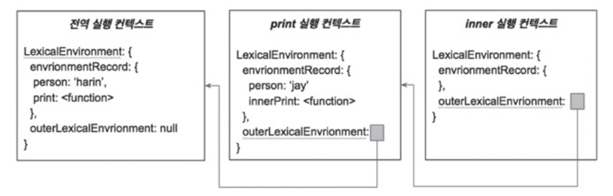

# Javascript 200 제

## 16 숫자형

- 자바 스크립트 숫자형은 `64-bit Floating Point`(64비트 부동 소수점)

  - 국제 IEEF 754 표준에 따라 정의된 방식
  - 숫자값을 64 비트 정보로 저장
  - 0 ~ 51 숫자
  - 52 ~ 62 지수
  - 63 부호

- `Infinity`

  - 무한대 의미

- `NaN`

  - Not a Number

  - 산술 연산 결과가 유효하지 않은 값

  - 숫자가 너무 커서 표현할 수 없는 값

## 17 문자형

- 값이 텍스트 형태인 데이터
- 문자혈 표현 할 때는
  - `"` 큰 따옴표
  - `'` 작은 따옴표
  - ` 억음 부호
  - 와 함께 사용
- `\n` 으로 개행 가능

## 18 - 불린형

- `true` or `false` 값으로 이뤄진 자료형
- `<` `>` 등의 관계 연산자로도 나올 수 있음

```js
console.log(2 > 1); // true
console.log(2 < 1); // false
```

## 19 - null & undifined

- 공통적으로는 빈 값이나 없는 값 의미
- `null`

  - 비어 있는, 존재하지 않는 값 의미
  - 값의 부재 의미

- `undefined`
  - 변수 정의 되었지만 `아무 값도 할당받지 않은 상태` 의미
  - 함수에서 명시적으로 값을 반환하지 않았을 때
  - 변수에 어떠한 값도 대입하지 않고 정의 했을 때 `undefined` 반환

## 20 - 템플릿 문자열

- 템플릿 문자열은 ` (억음 부호)로 작성
- ${} 를 이용하여 삽입 처리 `interpolation` 가능

## 21 - 산술 연산자

- 자바스크립트 산술 연산자에는 표준 산술 연산자 ( + - \* / )가 있음
- 수학에서 배웠던 것처럼 산술 연산자 통해 숫자형 값 계산 가능
- 자바스크립트에서는 두 개 이상의 문자열을 + 연산자 통해 이어 붙이기 가능

## 22 - 비교 연산자

- 두 개의 값 비교하여 `true` or `false` 반환
- `일치 연산자` vs `관계 연산자`
  - 일치 연산자: 값의 일치 여부
    - 동등 연산자 `==`
    - 부등 연산자 `!=`
    - 일치 연산자 `===` - 자료형 까지 일치하는가?
    - 불일치 연산자 `!==` - 같은 자료형에서 값의 내용 다르거나 다른 자료형인 경우 `true`\
  - 관계 연산자: 두 개 값 간의 크기 비교통해 관계 확인
    - `>` `<` `>=` `<=`
- 자바스크립트는 숫자형 비교 외에도 문자형에서도 비교 연산 가능
  - 대문자가 소문자보다 앞선 순서
  - 유니코드 기준에 따라 Binaryu를 통한 연산으로 처리되는 것

## 23 - 논리 연산자

- `Logical Operators`
- 어떠한 명제에 대한 논리적인 판단 내리는 연산자
- 참 또는 거짓의 값을 받아 논리적 연산의 결과로 `ture` or `false` 반환
- 종류
  - AND 연산자 `&&`
  - OR 연산자 `||`
  - NOT 연산자 `!`
- 결과는 항상 `Boolean` 자료형으로 반환
- 불리형 자료형이 아니더라도 값을 논리 연산자로 처리하면 참 거짓 판별 구분 가능
  - 정보가 유효한 경우 `true`
  - 정보가 비어 있어 유효하지 않은 경우 `false`
    - false
    - 0
    - -0
    - ""
    - NaN
    - null
    - undefined

## 24 - 삼항 연산자

- `if`/`switch` 처럼 조건물을 처리하는 연산자
- 일반적으로 if 조건문의 축약형으로 사용
- 세 개의 문장으로 구성

```js
조건문 ? 표현문 1 : 표현문 2
```

- 조건문은 반드시 결과가 `true` or `false`로 반환되어야 함
- 결과 `true` -> 표현문 1
- 결과 `false` -> 표현문 2

## 25 - 비트 연산자

- 비트`Bit`란?

  - 이진수 `Binary digit`의 줄임말
  - 0과 1로 구성된 숫자 체계를 갖고 있는 이진수의 단일 값을 가짐
  - 컴퓨터 세계에서 비트는 `데이터의 가장 작은 기억장치의 최소 단위`
  - 1바이트 = 8비트

- 비트는 바이트`Byte`와 같이 자주 언급되는 용어

- 바이트는 `컴퓨터 용량의 기본 단위`

  - RAM과 HDD의 용량, 파일 브라우저에서 보여지는 파일 크기 등을 측정하는 단위로 쓰임

- 비트를 활용한 연산이 `비트 연산자`

- 자바스크립트의 비트 연산자

  - `비트 논리 연산자` & `비트 이동 연산자`

  - 비트 논리 연산자

    - AND 연산자 `&`
    - OR 연산자 `|`
    - XOR 연산자 `^`

  - 비트 이동 연산자

    - `<<`
    - `>>`
    - `>>>`

  - AND 비트 연산자 `&`

    - `a & b` 로 작성
    - 곱하기 처럼 하나라도 0 이면 결과 값 = 0
    - 반대로 대응 되는 비트는 변화
    - 모든 값이 1일 때만 1 반환
    - ex) 1110 & 1011 = 1010 => 10(10)

  - NOT 비트 연산자 `~`

    - `~a` 로 작성
    - 입력된 비트값을 반대의 값으로 바꾸어 변환
    - ~1110 => -1111 = -15(10)

  - OR 비트 연산자 `|`

    - `a | b`
    - 대응되는 비트값 중 최소 하나만 1이어도 1 반환
    - 1110 | 1011 = 1111 = 15(10)

  - XOR 비트 연산자 `^`

    - `a ^ b`
    - 배타적으로 1인 경우에만 1 반환 (모두 1이면 0)
    - 1110 ^ 1011 => 0101 = 5(10)

  - `<<` 비트 연산자

    - `a << b`

    - a의 이진수 표현을 b 비트의 자리수만큼 왼쪽으로 이동하고 오른쪽 0으로 채움

    - ```js
      console.log(2 << 2);
      ```

    - 위 식은 이진수 10을 10비트 자리수(2개)만큼 왼쪽으로 이동하고 오른쪽 0 채움

    - 따라서 결과값은 1000 = 8(10)

  - `>>` 비트 연산자

    - `a >> b`

    - a의 이진수 표현을 b 비트의 자리수만큼 오른쪽으로 이동

    - 오른쪽 남는 비트 버림

    - 왼쪽 빈자리는 원래 해당 자리에 있던 비트값으로 채움

    - ```js
      console.log(14 >> 1);
      ```

    - 위 식은 1110을 1비트 자리수(1개)만큼 오른쪽으로 이동하여 연산 계산하면 111이됨 (7(10))

  - `>>>` 비트 연산자

    - `a >>> b`

    - a의 이진수 표현을 b 비트만큼 오른쪽으로 이동

    - 오른쪽 남는 비트는 버리고 왼쪽 빈자리는 0으로 채움

    - ```js
      console.log(14 >>> 2);
      ```

    - 위 식은 1110을 10비트(2개)만큼 오른쪽으로 이동

    - 따라서 11 = 3(10)

  - ```js
    150.toString(2);  // 10010110
    ```

  - 비트 연산을 위해 이진수로 변환하는 방법

## 26 - 자료형 변환 이해하기

- 자바스크립트는 자료형 간 변환을 지원
- 이를 자료형 변환`type coercion` or 형변환 이라 부름
- 자료형 변환 방법은 두 가지
  - 개발자가 직접 명시적으로 자료형 변환
  - 자바스크립트 엔진에 의해 자동으로 자료형 변환
- 엔진에 의한 자동 자료형 변환은 자바스크립트가 `동적 자료형 언어`이기 때문에 적용되는 특징

## 27 - 배열

- 배열 자료형 형태는 `[]`와 괄호 사이의 요소들로 구성됨
- 자바스크립트에서는 배열의 길이와 자료형은 고정되지 않음
- 배열 내부 특정 위치 요소 접근할 때에는 `Index`가 반드시 필요
- index 는 배열 안의 좌표인 셈
- 배열 범위 밖의 index 호출하면 `undefined` return

## 28 - 객체 1

- 원시 자료형은 `하나의 값` 저장
- `Object`를 통해 여러 개 값을 한번에 접근할 수 있게 함
- `Object`
  - 값들을 그룹으로 묶은 데이터 모음
  - `{}`사용
  - `Key` `Value` 쌍으로 값을 정의하며 이를 `Properties`라고 부름
- 하나의 `Key`에는 하나의 `value` mapping
- 객체 내 중복된 `key`허용 x
- `JSON`
  - JavaScript Oject Notation
  - 자바스크립트의 객체와 매우 유사한 구조를 지닌 데이터 교환 `format`
  - JavaScript 에서는 JSON을 분석 및 직렬화하는 method들을 제공하는 JSON Object 존재

## 29 - 객체 2

- 객체 속성 접근 방법은 객체 우측에 콤마`.`를 두고 정의된 키 이름 작성

- 또는 `[]` 안에 키 값을 문자열로 작성하는 방법

- ```JS
  delete Ojbect.key
  ```

  - 객체 속성 삭제하는 법

## 30 - ES6의 향상된 객체 문법 - 단축 속성명

- 단축 속성명
  - 변수가 미리 준비되어 있다면
  - `{변수명}` 을 통해 `key` `value` 를 한번에 정의할 수 있음
  - key = 변수명이 되고 value 는 변수의 값이 됨

## 31 - ES6의 향상된 객체 문법 - 속성 계산명

- 속성 이름을 정의하는 다른 방법

- `[]` 에 식을 넣거나 변수를 대입하여 동적으로 객체 속성들을 생성할 수 있음

- ```js
  var obj = {};
  for (var i = 0; i < 4; i++) {
    obj["key" + i] = i;
  }
  ```

- 위와 같은 코드를 실행하면

- ```js
  obj = {
    key0: 0,
    key1: 1,
    key2: 2,
    key3: 3,
  };
  ```

- 과 같이 동적으로 value 생성

## 32 - ES6의 향상된 객체 문법 - 비구조화 할당

- Destructuring Assignment

  - 배열이나 객체 값 새로운 변수에 쉽게 할당

- ```js
  var obj = { a: 1, b: 2, c: 30, d: 44, e: 5 };
  var { a, c } = obj; // a = 1, c = 30
  var { a: newA = 10, f: newF = 5 } = obj; // newA = 1, newF = 5
  ```

- 위와 같이 객체 구조 분해를 통해 값 할당 가능

- a:newA=10 이 의미하는 것은 obj 의 a 키 값에 해당하는 밸류를 newA에 할당하는 것이고 만일 해당 키가 undefined로 값이 없는 경우에는 기본값 10으로 할당한다는 의미

- 배열 비구조화 할당은 중괄호를 `[]` 대괄호로 바꾸면 됨

## 33 - Symbol

- `Symbol`은 함수 호출을 통해 생성 가능

- new 키워드를 통한 호출(new Symbol()) 할 경우 에러 발생

- `Symbol` 함수 호출 시 값 전달 가능 - 디버깅 용도

- `Symbol`은 늘 고유한 값 반환

  - ```js
    console.log(Symbol("symbol") === Symbol("symbol")); // false
    console.log(Symbol() === Symbol()); // false
    ```

- `Symbol`은 객체의 키로 사용 가능

  - 객체의 키로 사용하기 위해 `Symbol`에 대한 레퍼런스를 변수에 담고 있다가 접근할 때마다 사용해야 함

  - ```Js
    const natinoility = Symbol('nationility');
    const user = {
        name: 'jay'
    };
    user[nationility] = 'korean';
    console.log(user[nationility]);  // korean
    ```

- `Symbol`이 객체 키로 사용되면 `for-in` 루프를 통해 심볼 키를 가져올 수 없음

  - ```js
    for (let key in user) {
      console.log(key); // name
    }
    ```

- 따라서 Object 키 반환하는 메소드를 사용해도 가져올 수 없음

- JSON 무자열로 만들 때에도 해당 키는 빠지게 됨

## 34 - 함수

```js
function 함수 이름 (매개변수 목록) {
  함수 실행부
}
```

- 함수 형태를 표현하면 크게 네 가지로 구분

  - 키워드 function
    - ES6부터 function 없이도 함수 선언 가능
  - 함수 이름
    - 함수 식별
    - 함수 내에서 재귀로 자기 자신을 참조 가능
    - 이름을 정의하지 않은 함수도 존재: 익명함수
  - 매개변수 목록
    - 함수 선언 시 매개변수 목록을 정의하면 함수를 호출할 때 인자값 전달 가능
  - 함수 실행부
    - 함수가 호출되면 실행되는 몸통부

- 자바스크립트 함수 만드는 두 가지 방식
  - 함수 표현식 - 함수 정의하는 동시에 변수에 할당
  - 함수 선언문 - 다른 언어에서도 일반적으로 쓰이는 함수 선언 방식

## 35 - 예외 처리

- 자바스크립트는 코드 실행하다 에러나면 즉시 중지
- 이를 대비한 예외처리는 반드시 필요
- 자바스크립트에서 예외 처리 방법은
  - `throw`
  - `try-catch-finally`
  - 사용 가능
- 예외 처리 시 에러 종류는 크게 두 가지로 나뉨
  - 예상치 못한 에러
  - 개발자가 의도한 에러
    - 코드에서 잘못될 가능성을 예상하고 발생시키는 에러
    - `throw` 사용
    - `throw`는 고의로 에러를 발생시켜 예외 상황을 알리는 역할
    - 실행되면 실행되고 있던 블록을 빠져나감

```js
function checkNumber(val) {
  if (typeof val !== "number") throw "유효하지 않은 값입니다.";
  console.log("숫자형 값으로 확인되었습니다.");
}

checkNumber(100); // 숫자형 값으로 확인되었습니다.
checkNumber("Wrong type");
console.log("완료");
```

- 위 코드에서 두 번째 checkNumber에서 에러가 발생하며 예제 코드 실행이 중단됨
- 따라서 최하단의 콘솔 로그는 실행되지 않음
- `throw`는 예외 상황을 미리 파악하고 에러를 발생시켜 이후 코드 실행되지 않도록 함
- 이는 결국 에러 발생시킨 것이기에 프로그램 중단되는 걸 막을 순 없음
- 이 에러에 대한 대응책이 바로 `try-catch-finally`
  - `try` 블록 안에서 발생된 에러 잡고
  - `catch` 블록으로 제어권 넘김
  - `try` 블록에서 발생된 에러 정보는 `catch` 문 변수로 전달
  - 개발자는 프로그램 종료 없이 어떤 에러 발생했는지 확인 가능
  - `finally` 블록은 에러 발생 여부 상관없이 실행되는 블록
  - 예를 들어 파일 읽기/쓰기 할 때 에러 발생되더라도 항상 파일 close 구문 실행 가능

```js
function checkNumber(val) {
  if (typeof val !== "number") throw "유효하지 않은 값입니다.";
  console.log("숫자형 값으로 확인되었습니다");
}

try {
  checkNumber(100);
  checkNumber("Wrong type");
} catch (e) {
  console.log(`에러가 발생했습니다 >>> ${e}`);
} finally {
  console.log("완료");
}
```

## 36 - arguments object

- javascript function 은 매개 변수를 가짐
- 매개 변수와 같이 사용되는 용어가 `전달 인자`argument
- 매개변수가 함수 선언 시 작성되는 변수라면

  - 전달 인자는 함수가 호출될 때 전달되는 `값`

- javascript는 전달 인자의 개수와 매개변수의 개수가 달라도 에러 발생하지 않음
  - 따라서 매개변수와 무관하게 함수 호출 시 더 많은 인자 전달 가능
  - 매개변수 외에 함수에서만 사용 가능한 특별한 객체 제공
  - 바로 `argument` object

```js
function sum() {
  let total = 0;
  for (let i=0; i < arguments.length; i++>) {
    total += arguments[i];
  }
  console.log(arguments instanceof Array);  // 아래 함수 실행 시 false
  console.log(arguments.indexOf(1));
  // arguments objects is not Array and occur error
  return total;
}

let sumOf1to3 = sum(1, 2, 3);
console.log(sumOf1to3);  // 6
```


## 37 - 함수 기본 매개변수 처리하기

* ES6에서 새로 추가
* 기본 매개변수
  * 매개변수 정의 시 기본으로 할당될 인자값과 함께 작성하는 매개변수
  * 값을 할당하는 연산자인 `=` 이용하여 정의

```js
function drawChart(width = 200, height = 400) {  // height = width / 2 식으로도 가능
    console.log(`Drawing ${width} X ${height} chart`);
}
drawChart(100);  // Drawing 100 X 400 chart
drawChart();  // Drawing 200 X 400 chart
```


## 38 - 함수 나머지 매개변수

* ES6에서 새로 추가
* 매개변수 정의 시 정해지지 않은 매개변수들을 정의할 수 있게 함
* `arguments`객체와 유사
  * but, `arguments object`는 함수에 전달되는 모든 전달인자 포함
  * 나머지 매개변수는 정해지지 않은 나머지 의미
* 나머지 매개변수는 arguments object와 다르게
  * 매개변수를 작성하는 곳에서 작성
  * 다른 매개변수와 차이점 두기 위해 `...` 연산자와 함께 작성

```js
function(parameter, ...restParameter) {
    // arguments 객체는 나머지 매개변수와 다르게 함수 몸통에서만 사용
}
```

* `arguments object` 와 나머지 매개변수와 가장 큰 차이점
  * `arguments object`: 배열 X
  * 나머지 매개변수: 배열 O

```js
function sum(...args) {
    let total = 0;
    for (let i = 0; i < args.length; i++) {
        total += args[i];
    }
    console.log(args.indexOf(1))  // args는 배열이기에 indexof 접근 가능, 콘솔값: 0
    return total;
}
console.log(sum(1, 2, 3));  // 6

function sum2(a, b, ...others) {
    let total = a + b;
    for (let i = 0; i < others.length; i++) {
        total += others[i];
    }
    return total;
}
console.log(sum2(1, 2));  // 3
console.log(sum2(1, 2, 3, 4));  // 10
```


## 39 - Scope

* `Scope`는 유효범위
  * 변수와 매개변수가 어디까지 유효한지 나타냄
  * 예를 들어, 코드에서 a라고 작성했을 때 a라는 식별자가 어디를 참조할지, 실제 값이 무엇인지 찾을 때 스코프 활용하여 찾게 됨
* Javascript는 기본적으로 `Global` & `function` 단위로 scope 생성
  * 함수 안에서 선언된 변수는 함수 블록 안에서만 접근 가능
  * 전역에 선언한 변수들은 코드 어디에서든 접근 가능

```js
var a = 10;
console.log(a);  // 10

function print() {
    var b = 20;
    if (true) {
        var c = 30;
    }
    console.log(c);  // 30
}

print();
console.log(b);  // ReferenceError: b is not defined
```


* Scope는 일반적으로 Lexical Scope & Dynamic Scope로 분류
  * Lexical Scope: 코드 작성하는 시점에 스코프가 결정됨, 정적 스코프라고도 불림
  * Javascript는 대표적인 Lexical Scope

```js
var a = 'global';

function print1() {
    console.log(a);
}

function print2() {
    var a = 'local';
    print1();
}

print1();
print2();
```

* 위 코드 실행 시 모두 global이 출력
* 만약 Javascript가 아닌 Dynamic Scope였다면 global 다음에 local이 찍혔을 것


## 40 - 함수 호이스팅

* Javascript에서는 함수 선언 전에 호출 가능
* 이러한 현상을 `호이스팅`이라 부름
* `호이스팅`을 직역하면 `끌어 올리기`
  * 함수가 실제 호출하기 이전으로 끌어 올라간 것처럼 동작하기 때문

```js
hello();
function hello() {
    console.log('hi')
}
```

* 위 코드의 콘솔에서 `hi`가 찍힘
* 함수를 선언문이 아닌 표현식을 통해 변수에 할당하여 호출 해 보면?

```js
hello2();
var hello2 = function () {
    console.log('hi');
}
```

* TypeError 발생
* 조금 의외
* 실제로는 hello2 이름으로 선언된 변수는 호이스팅이 이뤄짐
* 여기에 undefined가 할당
* 그래서 undefined는 호출할 수 없기에 TypeError 발생
* 만약 호이스팅이 이뤄지지 않았다면 ReferenceError로 hello가 선언되지 않았다는 에러가 나와야함
* 결과는 다음과 같이 나올 것임

```js
// Uncaught TypeError: hello is not a function
```


* 호이스팅은 자바스크립틔 코드를 해석하고 실행하는 방식 때문에 나타남
  * 자바스크립트는 코드를 해석하는 단계와 실행하는 단계로 나뉘고
  * 해석하는 단계에서 선언 문장을 초기화하면서 스코프를 형성하고
  * 실행하는 단계에서 값을 할당하거나 계산을 하는 행위를 한다고 볼 수 있음
* 두 번째 코드를 다시 보면
  * 해석 단계에서 2라인의 hello2 변수를 선언하는 문장이 먼저 초기화를 하여 스코프에 hello2라는 이름에 undefined라는 값 할당
  * 실행 단계에서 1라인의 hello2()를 호출하는 것


## 41 - let

* ES6 등장 이전에는 var 키워드로만 변수 정의 가능했었음
* `let`의 등장을 통해 변수 선언 시 변수의 유효 범위를 `블록 범위`로 지정할 수 있게 됨

```js
if (true) {
    var functionScopeValue = 'global';
    let blockScopeValue = 'local';
}
console.log(funcitonScopeValue);  // global
console.log(blockScopeValue);  // ReferenceError: blockScopeValue is not defined
```

```js
let value = "outside value";
if (true) {
    console.log(value);  // Uncaught ReferenceError: value is not defined
    let value = "inside value";
}
```

* `let`으로 선언한 변수는 호이스팅에서 설명한 것과 같이 블록 단위로 일어남
* 하지만 `var`와 달리 undefined 값이 할당되지보다 블록 시작부터 선언이 이루어진 라인까지 일시적으로 접근 막음
* 만약 블록 내의 `let value = "inside value"`가 없다면 전역에서 정의된 value를 참조하여 "outside value" 가 출력됨
  * 하지만 if 블록 안에서 let으로 변수 정의를 했기에 value는 if 블록 안에 위쪽으로 호이스팅되어 실제 let으로 선언이 이루어지기 전까지 일시적으로 접근이 안 되는 영역을 만들고 그 안에서 접근하게 되면 에러 발생하는 것


## 42 - const

* `const`키워드는 `let`키워드와 마찬가지로 블록 단위로 스코프를 정의할 수 있음
* `let`과의 차이점: 선언 시 값 할당해야 함 + 이후에 재할당 불가
* 객체로 선언시 내부 값은 변경 가능
  * but, 새로운 객체 할당은 불가


## 43 - Scope Chain의 이해

* 함수 안에 함수를 선언한 중첩 함수(Nested Function)에서 자식 함수가 부모 함수의 변수에 어떻게 접근 가능한가??

* 스코프 체인은 문자 그대로 스코프가 연결되어 있음을 의미

* 자바스크립트에서 스코프 체인 이해를 위해서는

  * 실행 컨텍스트 Execution context
  * 렉시컬 환경 Lexical Environment
  * 에 대해 먼저 알아야 함

* 실행 컨텍스트

  * 코드가 실행되기 위해 필요한 정보를 가짐
  * 실행 가능한 코드가 실행될 때 생성
  * 대표적인 실행 가능한 코드
    * 전역 코드
    * 함수 코드
    * 그 외에 eval과 모듈 코드 등
  * 처음에는 전역 코드가 먼저 실행
  * 이때 전역 컨텍스트 생성하고 전역 코드를 순차적으로 `평가`
  * 그러다 함수가 호출문 만나면 새로운 실행 컨텍스트 만들어지며 해당 함수 실행부의 코드를 순착적으로 평가
  * 이때 `Stack`을 이용해 실행 컨텍스트를 관리
  * 새로운 실행 컨텍스트 생성되면 스택에 쌓고 실행 중인 코드가 종료되면 해당 실행 컨텍스트를 스택에서 제거

  ```js
  var person = "harin";
  
  function print() {
      var person2 = "jay";
      
      function innerPrint() {
          console.log(person);
          console.log(person2);
      }
      innerPrint();
      
      console.log('print finished');
  }
  
  print();
  console.log('finished')
  ```

  * 위 코드의 크롬 콘솔은 다음과 같음

  ```
  harin
  jay
  print finished
  finished
  ```

  * 위 코드에서 실행 컨텍스트가 실행 될 때 시간에 따라 스택에 쌓이는 과정은

    * 전역 실행 컨텍스트
    * 전역 실행 컨텍스트 - print 실행 컨텍스트
    * 전역 실행 컨텍스트 - print 실행 컨텍스트 - innerPrint 실행 컨텍스트
    * 전역 실행 컨텍스트 - print 실행 컨텍스트
    * 전역 실행 컨텍스트 
    * 와 같은 구조를 가지게 됨

    

* 실행 컨텍스트는 렉시컬 환경을 가짐

  * 렉시컬 환경은

    * 환경 레코드 EnvironmentRecord
    * 외부 렉시컬 환경 OuterLexicalEnvironment
    * 로 구성

  * 실행 컨텍스트를 자바스크립트 객체 형태로 표현하면 다음과 같음

  * ```js
    ExecutionContext = {
        LexicalEnvironment: {
            EnvironmentRecord: {
                
            },
            OuterLexicalEnvironment: 참조
        }
    }
    ```

  * 실제 함수와 변수같은 식별자와 그 식별자가 가리키는 값은 key와 value 쌍으로 환경 레코드에 기록

  * 그리고 렉시컬 환경은 환경 레코드 외에 `자신의 실행 환경을 감싸는 외부 실행 환경`에 대한 참조를 가짐

  * 위 코드의 실행 컨텍스트와 내부 렉시컬 환경을 그림으로 나타내면 다음과 같음

  

* 각 실행 컨텍스트는 outerLexicalEnvironment로 체인처럼 연결되어 있음
* 이렇게 각 렉시컬 환경이 연결되어 있기 때문에 스코프 체인이 형성 될 수 있음

