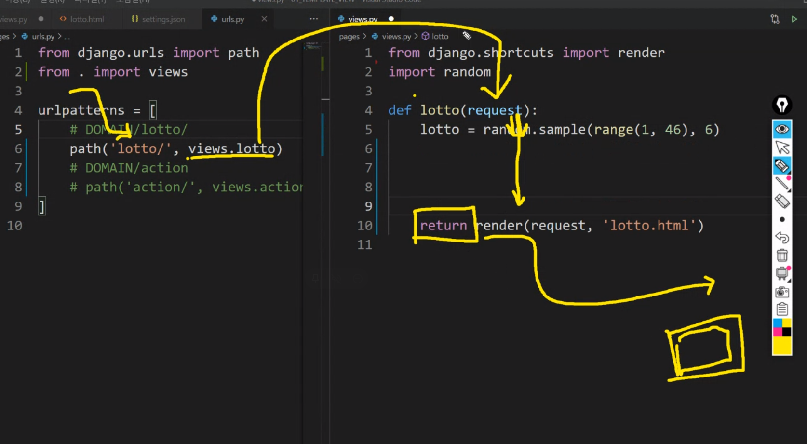
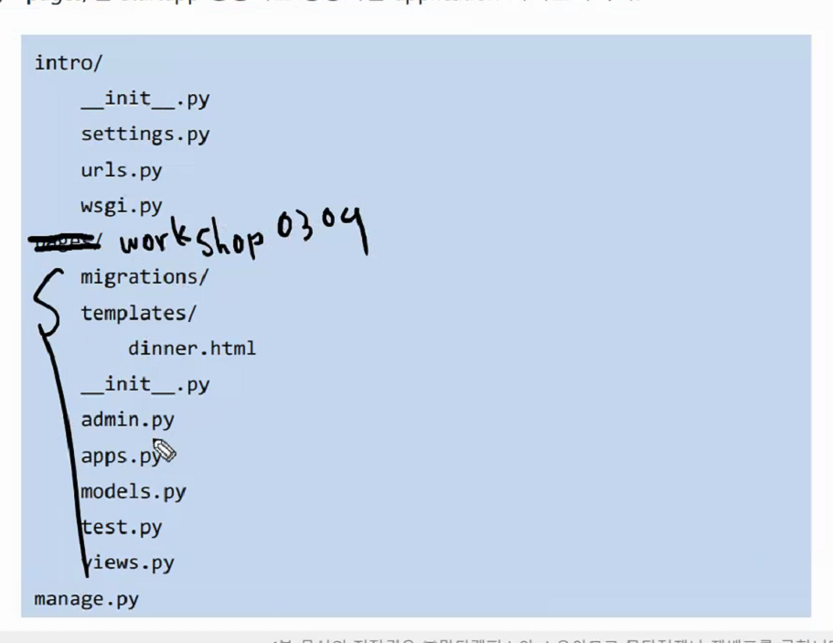
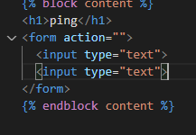
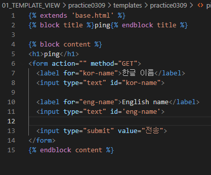
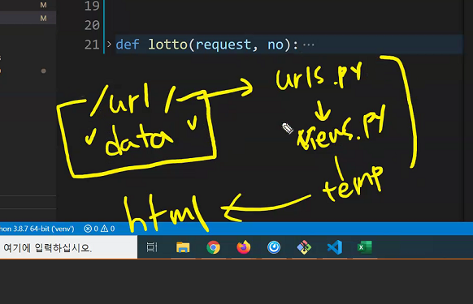
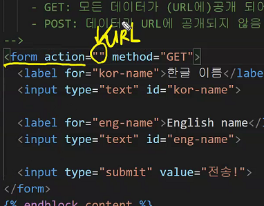
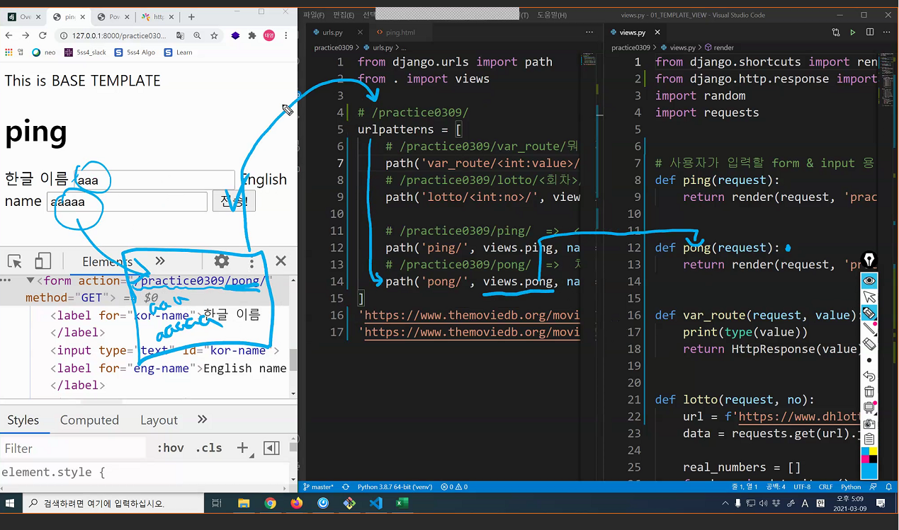
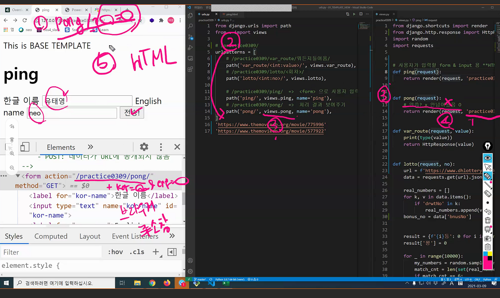
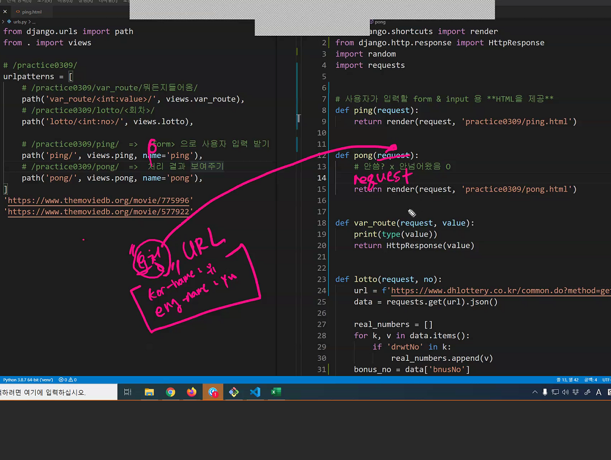
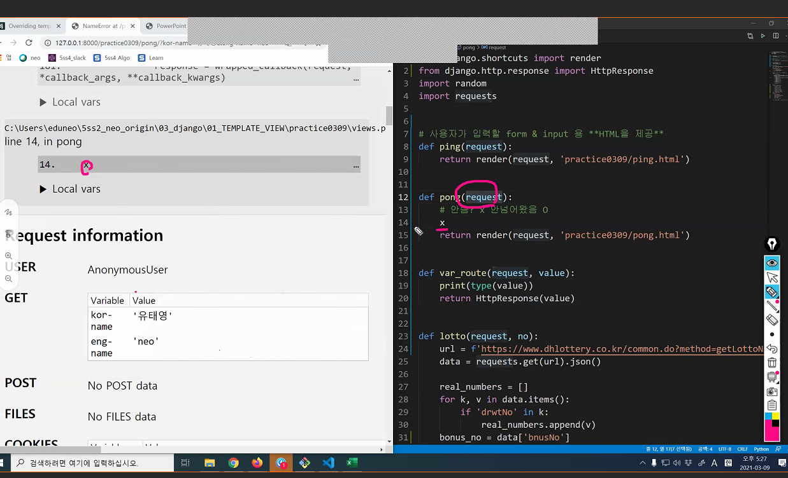

# django 프로젝트 만드는 순서

1. 프로젝트를 생성하려는 디렉토리에서 `git bash`
2. 빈폴더(프로젝트 Root)를 만든다.
   * `.gitigonore` 생성
   * `$ git init` 으로 REPO 초기화
   * `README.md` 생성
   * 원격 저장소 생성 후 연결
   * `add` => `commit` => `push`
3. 해동 폴더로  이동해서`$ python -m venv venv`  명령어를 통해`venv/` (가상 독립 환경)을 만든다.
4. 가상 독립 환경을 활성화(`activate`) 한다. (or vscode로 열기)
5. `$ pip install django +a` 를 통해 필요한 패키지들을 설치 한다.
6. `$ django admin startproject <PROJECT NAME> .` 명령어를 통해 프로젝트 초기화
7. 프로젝트 vscode로 열어서 진행

* 프로젝트 폴더 이름은 항상 대문자로만!!
  * 헷갈리지 않기 위해서

# 프로젝트 열기

반드시 프로젝트 Root 폴더 => 우클릭 => code로 열기

# 프로젝트 독립환경 설정

1. `ctrl` + `shift` + `p`
2. `>python: select Interpreter` 입력
3. 자동으로 가상환경 폴더(`venv/`) 안의 python을 잡지 못한다면
4. `Enter interpreter path` => `path` => `venv/Scripts/python` 을 선택
5. 적용 안되었으면, 터미널 휴지통 눌러서 완전히 종료하고 재실행 해보자
6. 완료 이후 좌하단에 `python 3.8.x 64-bit('venv') 문구를 확인하기

# 쟝고의 리턴 사이클

# 장고 템플릿 관리

app_name > tmeplates > app_name > .html

# workshop 0309 의 경우

dinner.html 만들어야함

* 어떻게 완성하느냐

# form

* 입력페이지와 결과페이지 두개의 페이지가 필요하다.

* html은 view와 1:1 관계 (후에 1:2 될수도 있지만 일단은 1:1)
* view -> return -> render -> html
* 즉, html 2개 view 2개 url 2개
  * 입력과 결과를 보여주기 위한 두 개의 세트

* form 은 

  * 수신인

  * 중요도

    * 이 두개!

  * action => 수신인 - 목적지

  * method => 공개 / 비공개 여부

    - GET: 모든 데이터가 (URL에) 공개 되어 전송
    - POST: 데이터가 URL에 공개되지 않음

    

    ​			포스트 잇 두개 붙인거

    * 어딘가로 보낼려면 양식을 따라야 하는데
    * 그것이 바로 `form tag` 이다
    * 그냥 포스트잇만 보낼 수 있겠냐
    * 나 혼자 보겠다는 거지
    * 양식을 따라야 보낼 수 있고 그 의미가 있는 것이다.

​		아직 여기까지는 서버와 아무 연관 없다

* 틀은 다 만들었다
* 이것을 pong 으로 보낼 것이다
* pong 이라는 view 함수는 요청을 받았을 때 실행이 되는 것이다

* 요청을 보낼 때 이제는 할말이 생겼으니
* url 에 내가 할 말을 녹여서 보낸다!

* action 에 url 적을 때 해당 url 로 요청이 가는 것이다

* 여기서 드는 나의 의문점
* 이후 보낸 데이터 처리는 어떻게 할까??
* 

데이터의 이동 경로

근데 아직 이 데이터를 쓰지못한다

* why?
  * 아직 key value 의 쌍으로 이루어지지 않았다

2. 3에 밀어붙임

3. view 3 으로 가서

4. pong.html 을 반환
5. hltml 출력

`요청 데이터`에 묶여서 온다!!!!!

* 매 함수에 request가 오는게 어느정도 납득이 간다
* 

교수님의 x 디버깅

* 장고는 에러의 전후사정을 모두 알려주기 때문에
* 의도적으로 x 를 적어 오류를 내
* 이전 상황을 살펴 볼 수 있다

오늘의 주요 내용

1. 템플릿
   1. url 먼저 받고 view 에서 일한다 context 에 녹여 낼 수 있다.
   2. dtl 에서는 block, extend, for, 출력은 {{ }} 만 일단 알자

2. view의 심화

   1. variable route 어느 부분에는 구멍을 뚫어놓을 수 있다
   2. 그럴 때는 <> 꺽쇠로 표시한다.
   3. 이 자리에 들어오는 것은 value 라는 변수에 들어가고
   4. 변수가 들어가 있을 경우에는 받아보는 입장에서 인자를 써줘야 한다. (request, value)
   5. context 에 굉장히 많은 내용을 때려 박을 수 있다.

3. 사용자가 입력할 form & input 용 html 제공 -> html 주면 끝 -> html 구성이 더 중요

4. 사용자 입력 데이터를 활용하는 view 함수

5. form 이 들고 있는 것은 수인인과 공개 여부

6. url 하드 타이핑 안하고  식으로 쓸 수 있음 (지금은 크게 중요치 않음)

7. label 은 의미론적으로 시멘틱 태그, 지금은 제껴도 됨

8. 중요한 것은 input 태그에 name 이 반드시! 있어야 한다.

9. 없다고 브라우저에 표시 안되지는 않지만 데이터가 넘어갈 수가 없다.

10. 데이터는 요청(request)과 함께 넘어간다.

11. request.GET 으로 받은 데이터에 접근할 수 있따.

12. 데이터를 접근할 때 키 값은 <input name="key"> 와 같다

    

