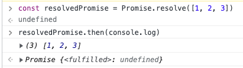

# Promise

* 기존 비동기 처리 방식의 문제점
  * 가독성이 안좋음 (Callback Hell)
  * Error 처치 곤란
  * 다수의 비동기 처리 한번에 처리하는 데 한계
* 이러한 문제점을 보완하기위해 ES6에서 `Promise` 도입
  * 전통적인 콜백 패턴의 단점 보완
  * 비동기 처리 시점 명확하게 표현 가능

## 콜백 패턴의 단점

### Callback Hell

* 비동기 함수를 호출하면

  * 함수 내부의 비동기로 작동하는 코드가 완료되지 않아도
  * 기다리지 않고 즉시 종료
  * 즉, 비동기 함수 내부의 비동기로 동작하는 코드는 비동기 함수 종료된 이후 완료
  * 따라서 비동기 함수 내부 비동기로 동작하는 코드에서
    * 처리 결과 외부 반환
    * 상위 스코프의 변수에 할당
  * 과 같은 처리가 기대한 대로 동작하지 않음

  ```JS
  let a = 0;
  setTimeout(() => { a = 1234; }, 0);
  console.log(a);  // 0
  ```

* 이러한 이유로 비동기 처리 결과를

  * 외부에 반환할 수도
  * 상위 스코프 변수에 할당할 수도 없음

* 따라서 비동기 함수 처리 결과에 대한 **후속 처리**는 함수 내부에서 수행해야 함

* 이러한 상황에서 일반적으로 사용되는 것이 **콜백 함수** 전달

* 이러한 처리가 계속해서 중첩되면 발생하는 것이 바로 **Callback Hell**

### Error Handling

```JS
try {
  setTimeout(() => { throw new Error('Error'); }, 1000);
} catch (e) {
  console.error('error: ', e);
}
```

* 위 코드에서 에러는 catch 코드 블럭에서 캐치되지 않음
  * 비동기 함수인 `setTimeout`이 호출되면 `setTimeout`함수의 실행 컨텍스트 생성 및 콜 스택에 푸시되어 실행
  * `setTimeout`은 비동기 함수이기에 콜백 함수 호출을 기다리지 않고 즉시 종료되어 콜 스택에서 제거
  * 이후 타이머 만료 후 `setTimeout` 함수의 콜백 함수는 태스크 큐로 푸시
  * 콜 스택이 비어졌을 때 이벤트 루프에 의해 콜 스택으로 푸쉬되어 실행
* `setTimeout` 함수의 콜백 함수가 실행될 때 `setTimeout` 함수는 이미 콜 스택에서 제거된 상태
  * 이것은 `setTimeout` 함수의 콜백 함수를 호출한 것이 `setTimeout` 함수가 아님을 의미!
  * `setTimeout` 함수의 콜백 함수의 caller가 `setTimeout` 함수라면
  * 콜 스택에서 실행 중인 실행 컨텍스트가 콜백 함수의 실행 컨텍스트라면
  * 그 하위 실행 컨텍스트는 `setTimeout` 함수여야 함
* 에러는 caller 방향으로 전파!
  * 즉, 콜 스택의 아래 방향으로 전파
  * 하지만 `setTimeout`의 콜백 함수를 호출한 것은 `setTimeout` 함수가 아님
  * 따라서 `setTimeout` 함수의 콜백 함수가 발생시킨 에러는 `catch` 블록에서 캐치되지 않음

이러한 불편한 이유로 하여금 `Promise`가 등장함


## Promise 생성

* `new` 연산자와 함께 생성

* ```js
  const promise = new Promise(callback(resolve, reject) => {
    if (처리 성공) {
      resolve()
    } else {
      // 처리 실패
      reject()
    }
  })
  ```

* Promise 생성자 함수가 인수로 전달받은 콜백 함수 내부에서 비동기 처리 수행

  * 처리 성공 → resolve 함수 호출
  * 처리 실패 → reject 함수 호출

* 프로미스는 다음과 같이 현재 비동기 처리 진행 상태를 나타내는 state 정보를 가짐

  * pending: 비동기 아직 수행 안됨, 프로미스 생성 직후 기본 상태
  * fulfilled: 비동기 처리 수행 상태(성공), resolve 함수 호출되면 변경
  * rejected: 비동기 처리 수행 상태(실패), reject 함수 호출되면 변경

* 생성된 직후 프로미스 기본적으로 pending 상태

  * 비동기 처리 성공 → resolve 함수 호출하여 프로미스를 `fulfilled` 상태로 변경
  * 비동기 처리 실패 → reject 함수 호출하여 프로미스를 `rejected` 상태로 변경

* `fulfilled` 상태와 `rejected` 상태를 합쳐 `settled` 상태라고 함

  * fulfilled/rejected 여부에 상관 없이 pending이 아닌 상태로 비동기 처리가 수행된 상태 의미
  * 프로미스는 pending 상태에서 fulfilled/rejected 둘 중 하나, 즉 settled 상태로 변화 가능
  * 하지만 일단 settled로 변경되면 다른 상태로 변화 불가능

* 실제 처리 예시

  * fulfilled
  * 
  * rejected
  * 

* 정리하자면, 프로미스는 비동기 처리 `상태`와 처리 `결과`를 **관리**하는 객체


## 프로미스의 후속 처리 메서드

* 프로미스의 비동기 처리 상태가 변화하면 이에 따른 후속 처리를 해야 함
  * fulfilled가 되면 프로미스 처리 결과로 무언가 하고
  * rejected가 되면 에러를 가지고 처리를 해야 함
  * 이를 위해 프로미스는 후속 메서드 `then`, `catch`, `finally` 메서드 제공
* 프로미스의 비동기 처리 상태가 변화하면 인수로 전달한 콜백 함수가 선택적으로 호출
  * 이때 후속 처리 메서드의 콜백 함수에 프로미스의 처리 결과가 인수로 전달
  * 모든 후속 처리 메서드는 프로미스를 반환 + 비동기로 동작

### Promise.prototype.then

* `then` 메서드는 두 개의 콜백 함수를 인수로 받음
  * 첫 번째 콜백함수: 프로미스가 fulfilled 상태가 되면 호출(resolve 함수 호출된 상태), 이때 콜백 함수는 프로미스 비동기 처리 결과를 인수로 전달 받음
  * 두 번째 콜백함수: 프로미스가 rejected 상태가 되면 호출(reject 함수 호출된 상태), 이때 콜백 함수는 프로미스의 에러를 인수로 전달 받음

```js
new Promise(resolve => resolve('fufilled'))
	.then(v => console.log(v), e => console.error(e));  // fulfilled
new Promise((_, reject) => reject(new Error('rejected')))
	.then(v => console.log(v), e => console.error(e));  // Error: rejected
```

* `then` 메서드는 언제나 프로미스 반환
  * 만약 then 메서드의 콜백 함수가 프로미스 반환하면 그 프로미스 그대로 반환
  * 프로미스가 아닌 값 반환하면 그 값을 암묵적으로 resolve or reject 하여 프로미스를 생성해 반환


### Promise.prototype.catch

* `catch` 메서드는 한 개의 콜백 함수를 인수로 전달받음
  * 이 콜백 함수는 프로미스가 rejected 상태인 경우만 호출됨

```js
new Promise((_, reject) => reject(new Error('rejected')))
	.catch(e => console.log(e));  // Error: rejected
```

* `catch` 메서드는 `then(undefined, onRejected)` 와 동일하게 동작
  * 따라서 `then` 메서드와 마찬가지로 언제나 프로미스 반환


### Promise.prototype.finally

* `finally` 메서드는 한 개의 콜백 함수를 인수로 받음
  * 프로미스의 성공 여부에 상관없이 무조건 한 번 호출
  * 프로미스의 상태와 상관없이 공통적으로 수행해야 할 처리 내용이 있을 때 유용
  * 언제나 프로미스 반환


## 프로미스 에러 처리

* 기존 비동기 처리는 에러 처리 곤란
* 프로미스는 가능!
* 비동기 처리 중 발생한 에러는 `then` 메서드의 두 번째 콜백 함수로 처리하거나 `catch` 메서드로 가능
  * 단 `then` 메서드의 두 번째 콜백 함수는 첫 번째 콜백 함수에서 발생한 에러를 캐치하지 못하고 가독성도 좋지 않음
  * `catch` 메서드를 모든 `then` 메서드 호출 이후 호출하면 비동기 처리에서 발생한 에러 뿐 아니라 `then` 메서드 내부에서 발생한 에러까지 모두 캐치 가능
  * 또한 `catch` 메서드 사용하는 것이 가독성이 좋고 명확
  * 따라서 에러 처리는 `then` 두 번째 콜백 함수보다는 `catch` 메서드를 적극 활용하자


## 프로미스 체이닝

* 비동기 콜백 패턴은 콜백 헬 발생하는 문제 있었음
* 프로미스는 `then`, `catch`, `finally` 후속 처리 메서드를 통해 이를 해결
  * 이들은 언제나 프로미스를 반환하므로 연속적으로 호출 가능
  * 이를 프로미스 체이닝이라 부름
  * 다만 프로미스도 콜백 패턴 사용하므로 가독성이 엄청 좋지는 않음
  * 이를 위해 ES8에서 도입된 `async/await` 가 있음
  * 프로미스 후속 처리 메서드 없이 마치 동기 처리처럼 프로미스가 처리 결과를 반환하도록 구현 가능


## 프로미스의 정적 메서드

### Promise.resolve/Promise.reject

* 이미 존재하는 값 래핑하여 프로미스를 생성하기 위해 사용




### Promise.all

* 여러 개의 비동기 처리를 모두 병렬 처리 할 때 사용

* 

* 위 예제는 세 개의 비동기 처리를 순차적으로 진행

  * 즉, 앞선 비동기 처리 완료하면 다음 비동기 처리 수행
  * 따라서 총 6초 이상 소요

* 위 세 개의 비동기 처리는 서로 의존하지 않고 개별적으로 수행됨

  → 순차적으로 진행할 필요 X

* 

  * 약 3초정도 걸림

* `Promise.all` 메서드는 프로미스를 요소로 갖는 배열 등의 이터러블을 인수로 받음

  * 전달받은 모든 프로미스의 상태가 모두 fulfilled 되면 모든 처리 결과를 배열에 저장해 새로운 프로미스 반환
  * 첫 번째 프로미스가 가장 나중에 fulfilled 상태가 돼도 처리 결과를 차례대로 배열에 저장 → 처리 순서 보장

* 하나라도 rejected 상태가 되면 나머지 프로미스가 fulfilled 상태가 되는 것 기다리지 않고 즉시 종료

* 인수로 전달받은 요소가 프로미스가 아니라면 `Promise.resolve` 메서드 통해 프로미스로 래핑


### Promise.race

* `Promise.all` 메서드와 동일하게 프로미스를 요소로 갖는 배열 등의 이터러블을 인수로 전달 받음
  * 모든 프로미스가 fulfilled 상태가 되는 것 기다리는 것이 아닌
  * 가장 먼저 fulfilled 상태가 된 프로미스의 처리 결과를 resolve 하는 새로운 프로미스 반환
  * rejected 상태의 경우 `Promise.all` 과 같이 처리됨


### Promise.allSettled

* 프로미스를 요소로 갖는 배열 등의 이터러블을 인수로 전달 받음
  * 전달받은 프로미스가 모두 settled 상태가 되면 처리 결과를 배열로 반환
* `Promise.allSettled` 메서드가 반환한 배열에는 fulfilled 또는 rejected 상태와 상관없이 인수로 전달받은 모든 프로미스들의 처리 결과가 모두 담겨 있음


* status를 공통 프로퍼티로 가지고 value/reason의 프로퍼티로 나뉨


## 마이크로태스크 큐

다음 예제의 로그 출력 결과는??

```js
setTimeout(() => console.log(1), 0);

Promise.resolve()
	.then(() => console.log(2))
	.then(() => console.log(3));
```

* 프로미스의 후속 처리 메서드의 콜백 함수는 태스크 큐가 아닌 `마이크로태스크 큐`에 저장됨
  * 마이크로태스크 큐는 태스크 큐와 별도의 큐
  * 여기에는 프로미스의 후속 처리 메서드의 콜백 함수가 일시 저장
  * 그 외 비동기 함수의 콜백 함수나 이벤트 핸들러는 태스크 큐에 일시 저장
* 콜백 함수나 이벤트 핸들러를 일시 저장한다는 점에서 태스크 큐와 동일
  * but, 마이크로태스크 큐는 태스크 큐보다 우선순위가 높음
  * 즉, 이벤트 루프는 콜 스택이 비면 먼저 마이크로태스크 큐에서 대기하고 있는 함수를 가져와 실행
  * 이후 마이크로태스크 큐가 비면 태스크 큐에서 대기하고 있는 함수 가져와 실행


