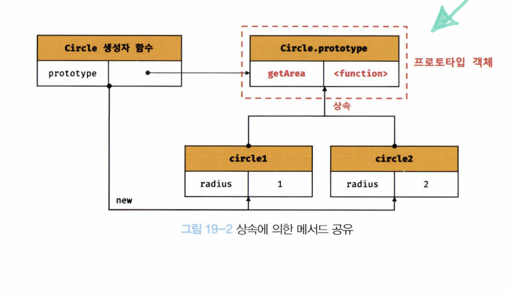
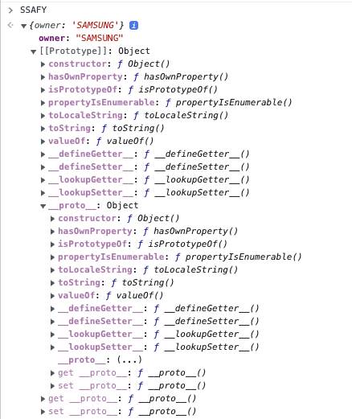

# Prototype

## 생성자 함수

`new` operator

* 생성자 함수는 이름 그대로 객체(인스턴스)를 생성하는 함수
  * 자바와 같은 클래스 기반 객체지향 언어 생성과 다르게
  * 형식이 정해져 있는 것이 아니라
  * 일반 함수와 동일한 방법으로 생성자 함수를 정의하고
  * `new` 연산자와 함께 호출하면 해당 함수는 생성자 함수로 동작
    * `new` 연산자 없이 하면 일반 함수로 동작

### Instance 생성 과정

* 생성자 함수의 역할
  * 프로퍼티 구조가 동일한 인스턴스를 생성하기 위한 템플릿(클래스)로써 동작하여
  * 인스턴스를 `생성`하는 것과 생성된 인스턴스를 `초기화`하는 것
    * 초기화: 인스턴스 프로퍼티 추가 및 초기값 할당
  * 생성자 함수가 인스턴스 생성하는 것은 필수
  * 생선된 인스턴스 초기화 하는것은 옵션
* 생성자 함수 내부코드를 살펴보면
  * `this`에 프로퍼티를 추가하고
  * 필요에 따라 전달된 인수를 프로퍼티의 초기값으로 할당하여 인스턴스 초기화
  * 근데, 인스턴스 `생성` `반환`하는 코드는 어디 있는가???
  * 자바스크립트 엔진은 암묵적인 처리를 통해 인스턴스 생성하고 반환

#### 1. 인스턴스 생성과 this binding

* 암묵적으로 **빈 객체** 생성 `{}`
  * 이 객체가 바로 생성자 함수가 생성한 인스턴스
  * 인스턴스는 `this`에 바인딩됨
  * 생성자 함수 내부의 this가 생성자 함수가 생성할 인스턴스 가리키는 이유가 바로 이것
  * 이 처리는 함수 몸체의 코드가 한 줄씩 실행되는 런타임 이전에 실행

#### 2. 인스턴스 초기화

* 생성자 함수에 기술된 코드가 한 줄씩 실행되어
  * this에 바인딩되어 있는 인스턴스 초기화
  * 즉, this에 바인딩되어 있는 인스턴스에 `프로퍼티`나 `메소드` 추가
  * 생성자 함수가 인수로 전달받은 초기값을 인스턴스 프로퍼티에 할당하여 초기화하거나 고정값 할당
  * 이 처리는 개발자가 기술

#### 3. 인스턴스 반환

* 생성자 함수 내부 모든 처리 완료 후
  * 완성된 인스턴스(바인딩된 this)가 암묵적으로 반환
* 만약 this가 아닌 다른 객체를 명시적으로 반환하면
  * this가 반환되지 못하고
  * return 문에 명시한 객체가 반환됨
  * 하지만 명시적으로 **원시 값**을 반환하면 원시 값 반환은 무시
  * 암묵적으로 `this`가 반환됨
  * 생성자 함수 내부에서 명시적으로 this가 아닌 다른 값 반환하는 것은 생성자 함수의 기본 동작을 훼손함
  * 따라서, 생성자 함수 내부에서 return 문을 반드시 생략해야함

### [[Call] / [[Construct]] 내부 매서드

* 함수 선언문/표현식으로 정의한 함수는 일반적 함수로써 호출 + 생성자 함수로써도 호출 가능
  * 생성자 함수로 호출한다는 건 `new` 연산자와 함께 호출하여 객체 생성하는 것 의미
* 함수는 객체임
  * 따라서 일반 객체와 동일하게 동작 가능
  * 함수 객체는 일반 객체가 지닌 내부 슬롯과 내부 메서드 모두 가지고 있기 때문

* 내부 슬롯/내부 메서드
  * 자바스크립트 엔진의 구현 알고리즘을 설명하기 위해 ECMAScript 사양에서 사용하는 의사 프로퍼티와 의사 메서드
  * ECMAScript 사양에 정의된대로 구현되어 자바스크립트 엔진에서 실제 동작하지만
  * 개발자가 직접 접근할 수 있도록 외부 공개된 객체의 프로퍼티는 아님
  * 즉, 내부 슬롯과 내부 메서드는 자바스크립트 엔진의 내부 로직
  * 간접적 접근만 가능
  * 예시
    * 모든 객체는 `[[Prototype]]` 내부 슬롯 가짐
    * 내부 슬롯은 자바스크립트 엔진의 내부로직이므로 원칙적으로 접근 불가
    * 하지만 `[[Prototype]]` 내부 슬롯의 경우 `__proto__`를 통해 간접적으로 접근 가능

* 함수는 객체이지만 일반 객체와는 다름

  * 호출 여부가 다른다
  * 일반 객체는 호출 불가 / 함수는 호출 가능
  * 따라서 함수 객체는 일반 객체가 가진 내부 슬롯과 내부 메서드를 포함하여
  * 함수로 동작하기 위한 함수 객체만을 위한 `[[Enviroment]]`, `[[FormalParameters]]` 등의 내부 슬롯과
  * `[[Call]]`, `[[Construct]]`와 같은 내부 메서드를 추가로 지님

* 함수가 일반 함수로 호출 - 함수 객체 내부 메서드 `[[Call]]` 호출

* `new` 연산자와 함께 생성자 함수로 호출 - 내부 메서드 `[[Construct]]`가 호출

* 내부 메서드 `[[Call]]`을 갖는 함수를 `callable`

* 내부 메서드 `[[Construct]]`를 갖는 함수 객체를 `constructor`

* `[[Construct]]`를 갖지 않는 함수 객체를 `non-constructor`라고 부름

* 모든 함수는 callable함 다만 생성자이거나 아니거나로 나눌 수 있음

* 자바스크립트의 구분

  * 함수 정의를 평가하여 non-/constructor 구분

  * constructor

    * 함수 선언문
    * 함수 표현식
    * 클래스(클래스도 함수임 자바스크립트에선)

  * non-constructor

    * method
    * arrow function

  * 주의할 것은 저기 method가 일반적 의미보다 좁다는 것

  * 자바스크립트에서는 ES6의 메서드 축약 표현만 메서드로 인정

  * ```JS
    const obj = {
      x() {}
    }
    
    new obj.x();  // TypeError: obj.x is not a constructor
    ```

  * 함수가 어디 할당되어 있는지가 아닌 정의 방식에 따라 구분함

* 함수 일반함수로 호출하면 함수 객체의 내부 메서드 `[[Call]]`이 호출

* `new` 연산자와 함께 생성자 함수로 호출하면 내부 메서드 `[[Construct]]`가 호출

* 주의점은 생성자 함수로 호출될 거 기대안하고 정의한 일반 함수에 `new` 연산자를 붙여 호출하면 생성자 함수처럼 동작할 수 있다는 것

* 내부에 this로 값을 초기화하는 생성자 함수를 만들었을 때

  * `new`연산자와 함께 생성자 함수로 호출하면 함수 내부의 this는 생성될 인스턴스를 가리킴
  * 하지만 일반함수로 호출하면 함수 내부 this는 전역객체를 가리키게 된다

* 추가로 찾아볼만 한 것

  * new.target
  * scope-safe constructor pattern


## Prototype

* JS는 객체지향 프로그래밍 언어임
  * 그 중에서도 `프로토타입` 기반의 객체지향 프로그래밍 언어임
  * 클래스가 있지만 사실 클래스도 함수임
    * 기존 프로토타입 기반 패턴의 syntactic sugar
    * 동일하게 동작하진 않음
    * 둘 다 프로토타입 기반의 인스턴스 생성하지만
    * 클래스는 생성자 함수보다 **엄격**
    * 생성자 함수에 없는 다른 기능들도 제공
    * 따라서 단순한 문법적 설탕이라기보단 **새로운 객체 생성 매커니즘**으로 보는게 좀 더 합당

### OOP

* JS를 이룬 거의 모든 것이 **객체**
  * 원시타입 제외한 나머지 값들(함수, 배열, 정규 표현식 등) 모두 객체임
  * 객체?
    * `속성`을 통해 여러 개의 값을 `하나의 단위`로 구성한 복합적인 자료구조
  * OOP는
    * 객체의 `state`를 나타내는 데이터와
    * state를 조작할 수 있는 `동작*behavior*` 을 하나의 논리적 단위로 묶어 생각
  * 따라서 객체는
    * 상태 데이터와 동작을 하나의 논리적 단위로 묶은 복합적 자료구조
    * 상태 데이터 - 프로퍼티
    * 동작 - 메서드

### 상속과 프로토타입

* `상속`은 OOP 핵심 개념
  * 어떤 객체의 프로퍼티나 메서드를 다른 객체가 상속받아 그대로 사용할 수 있는 것 말함
* JS는 프로토타입을 기반으로 상속을 구현
  * 불필요한 중복 제거
  * 중복 제거라 함은 기존 코드를 적극적으로 **재사용** 하는 것

```js
function Circle(radius) {
  this.radius = radius;
  this.getArea = function () {
    return Math.PI * this.radius ** 2;
  }
}

const circle1 = new Circle(1);
const circle2 = new Circle(2);
```

* 위 코드의 두 인스턴스는 각각의 `getArea` 메서드를 가진다.
  * 프로퍼티는 일반적으로 인스턴스마다 달리 값을 가지지만
  * 메서드는 모든 인스턴스가 동일하게 사용한다
  * 근데 위 Circle 생성자 함수를 통해 인스턴스를 생성할 때마다 `getArea` 메서드는 중복생성/소유한다.
  * 메모리 낭비!
  * 퍼포먼스도 안좋음
* 상속을 통해 이런 문제를 해결할 수 있다.
  * 여기서 prototype을 통해 구현

```js
function Circle(radius) {
  this.radius = radius;
}

Circle.prototype.getArea = function () {
  return Math.PI * this.radius ** 2;
}

const circle1 = new Circle(1);
const circle2 = new Circle(2);
```



* Circle 생성자 함수가 생성한 모든 인스턴스는 자신의 프로포타입,
  * 즉 상위(부모) 객체 역할을 하는 Circle.prototype의 모든 프로퍼티와 메서드를 상속받는다.
  * `getArea`는 단 하나만 생성
  * 상태를 나타내는 radius만 개별적으로 소유
  * 동일한 메서드는 상속을 통해 공유하여 사용

### 프로토타입 객체

* 프로토타입 객체란 OOP의 근간을 이루는 객체 간 상속을 구현하기 위해 사용

  * 프로토타입은
    * 어떤 객체의 상위(부모) 객체 역할을 하는 객체
    * 다른 객체에 공유 프로퍼티(메서드 포함) 제공
    * 프로토타입 상속받은 하위(자식) 객체는 상위 객체의 프로퍼티를 자신의 프로퍼티처럼 자유롭게 사용 가능

* 모든 객체는 `[[Prototype]]`이라는 내부 슬롯 가짐

  * 이 내부 슬롯 값은 프로토타입의 참조임
  * `[[Prototype]]`에 저장되는 프로토타입은 객체 생성 방식에 의해 결정
  * 객체가 생성될 때 객체 생성 방식에 따라 프로토타입이 결정되고 저장

* 객체의 경우

  * 객체 리터럴로 생성된 객체의 프로토타입은 Object.prototype임
  * 생성자 함수에 의해 생성된 객체의 프로토타입은 생성자 함수의 prototype에 바인딩되어 있는 객체

* 모든 객체는 하나의 프로토타입을 가짐

  * 그리고 모든 프로토타입은 생성자 함수와 연결돼 있음

  

* `[[Prototype]]` 내부 슬롯에는 직접 접근 불가지만

  * 위 그림처럼 `__proto__` 접근자 프로퍼티를 통해 자신의 프로토타입
  * 즉, 자신의 `[[Prototype]]` 내부 슬롯이 가리키는 프로토타입에 간접적으로 접근 가능
  * 그리고 프로토타입은 자신의 consturctor 프로퍼티를 통해 생성자 함수에 접근 가능
  * 생성자 함수는 자신의 prototype 프로퍼티를 통해 프로토타입에 접근 가능

#### \__proto__ 접근자 프로퍼티

* 모든 객체는 `__proto__` 접근자 프로퍼티를 통해 자신의 프로토타입에 **간접적**으로 접근 가능



* 참고

  * 내부 슬롯은 프로퍼티가 아님
  * 따라서 JS는 원칙적으로 내부 슬롯과 내부 메서드에 직접적으로 접근/호출 방법을 제공하지 않음
  * 단, 일부에 한하여 **간접적**으로 접근할 수 있는 수단 제공
  * 접근자 프로퍼티는 자체적으로 값(`[[Value]]` 프로퍼티 어트리뷰트)을 갖지 않고 다른 데이터 프로퍼티의 값을 읽거나 저장할 때 사용하는 접근자 함수(`[[Get]]`, `[[Set]]` 프로퍼티 어트리뷰트로 구성된 프로퍼티)임
  * `__proto__`접근자 프로퍼티를 통해 프로토타입에 적브하면 내부적으로 `__proto__` 접근자 프로퍼티의 getter 함수인 `[[Get]]`이 호출
  * `__proto__` 접근자 프로퍼티를 통해 새로운 프로토타입 할당하면 `__proto__` 접근자 프로퍼티의 setter 함수인 `[[Set]]` 이 호출

  * 예시 코드

  * ```js
    const obj = {};
    const parent = { x: 1 };
    
    obj.__proto__;  // getter 통해 obj object protype get
    obj.__proto__ = parent;  // setter로 obj protype change
    
    console.log(obj.x);  // 1
    ```

* `__proto__` 접근자 프로퍼티를 통해 프로토타입에 접근하는 이유

  * 상호 참조에 의해 프로토타입 체인이 발생하는 것 막기 위해

  * ```js
    const parent = {};
    const child = {};
    
    child.__proto__ = parent;
    parent.__proto__ = child;  // TypeError: Cyclic __proto__ value
    ```

  * 프로토타입 체인은 단방향 링크드 리스트로 구현돼야 함

  * 즉, 프로퍼티 검색 방향이 한쪽 방향으로만 흘러가야함

  * 위 코드는 순환 참조하는 프로토타입 체인이 만들어져 무한 루프 발생

  * 따라서 아무 체크 없이 무조건적으로 프로토타입 교체 못하도록 접근자 프로퍼티를 통해 프로토타입에 접근/교체하도록 구현되어 있음

* 하지만 `__proto__` 접근자 프로퍼티를 코드 내에서 직접 사용하는 것은 권장 ㄴㄴ

  * 모든 객체가 `__proto__` 접근자 프로퍼티 사용할 수 있는 것이 아님
  * 직접 상속을 통해 Object.prototype을 상속받지 않는 객체를 생성할 수도 있기 때문
  * 대신 `Object.set/getPrototypeOf` 메서드를 사용하자

#### 함수 객체의 prototype 프로퍼티

* 함수 객체만이 소유하는 prototype 프로퍼티는 생성자 함수가 생성할 인스턴스의 프로토타입 가리킴