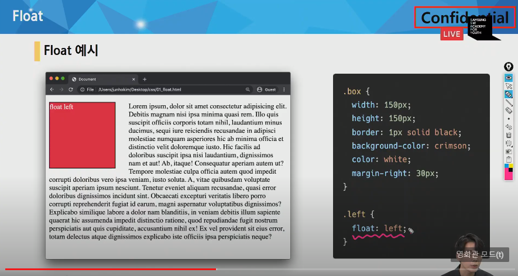
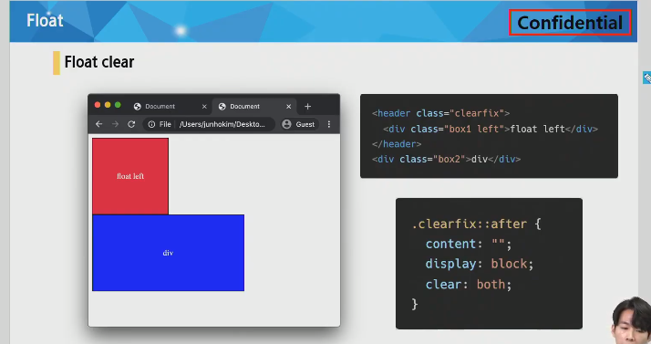
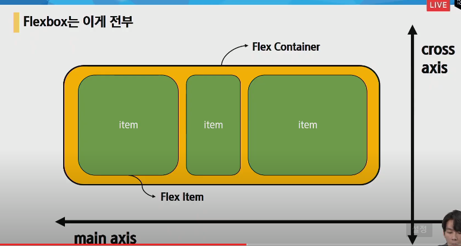
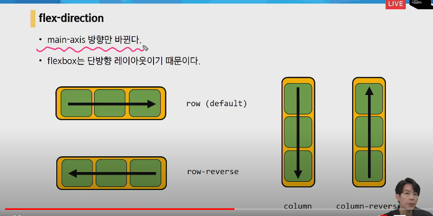
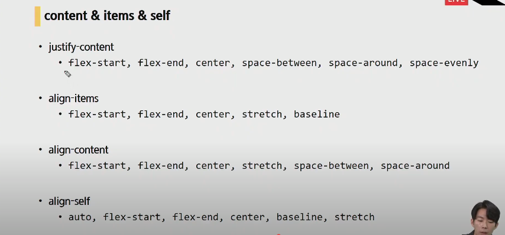
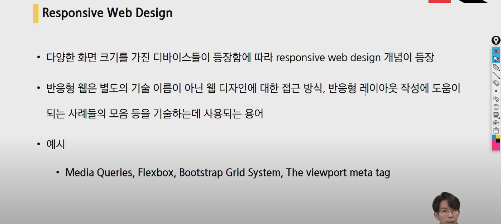
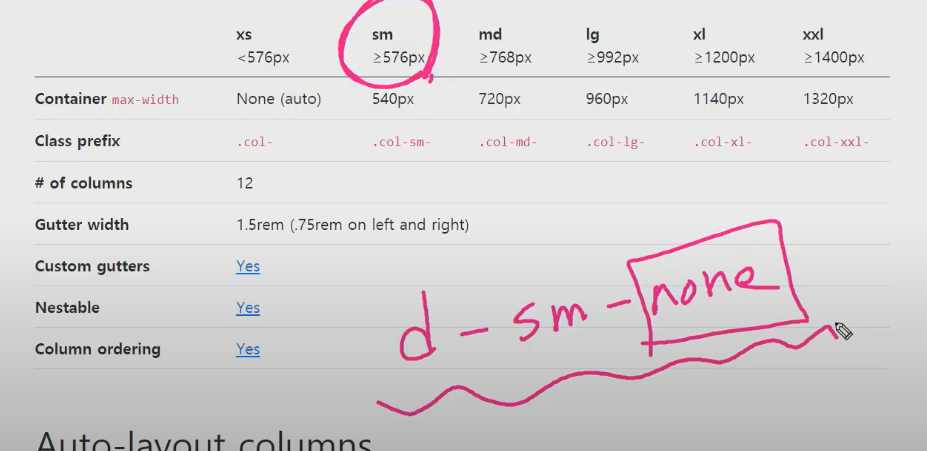

CSS layout : 웹 페이지에 포함되는 요소들 취합, 어디에 놓일 것이닞 제어하는 기술

display

postion

float

flexbox

grid

## float

본래는 이미지 좌, 우측 주변으로 텍스트 감싸는 레이아웃을 위해 도입

나아가 이미지 아닌 다른 요소들에도 적용, 웹 사이트 전체 레이아웃 사용까지 발전

속성

none : 기본값

left : 요소를 왼쪽으로 띄움

right : 요소를 오른쪽으로 띄움

Lorem : dummy data

문제점

다른 레이아웃에 영향

.clearfix::after {

​	content: "";

​	display: block;

​	clear: both;

}

내용 없는 빈 블락 만드는 것

float된 부모에게 적용하는 것

## Flexbox

CSS Flexible Box Layout

요소 간 공간 배분, 정렬 기능 위한 1차원(단방향) 레이아웃

크게 2가지 기억 요소 축

​	요소

​		Flex Container (부모 요소)

​		Flex Item (자식 요소)

​	축

​		main axis (메인축)

​		cross axis (교차축)

축 2개 요소 2개!

flex container 통해 조절한다

flexbox의 시작

.flex-container {

​	display: flex;

}

부모요소에 flex 혹은 inline-flex

속성

배치 방향 설정 : flex-direction

메인축 방향 정렬 : justify-content

교차축 방향 정렬 : align-items, align-self, align-content

기타 : flex-wrap, flex-flow, flex-grow, order, flex-shrink, flex-basis

justify = 메인축 / align = 교차축

content & items & self

contnet : 여러 줄

items : 한 줄

self : flex item 개별 요소

예시

​	justify-content : 메인축 기준 여러 줄 정렬

​	align-items : 교차축 기준 한 줄 정렬

​	align-self : 교차축 기준 선택한 요소 하나 정렬

## bootstrap

빠르게, 반응형, 가장 유명 프론트엔드에서, responsive grid system, prebuiltin component

justify-content: main axis 기준(주축)으로의 움직임

align-items: cross 기준으로의 움직임

